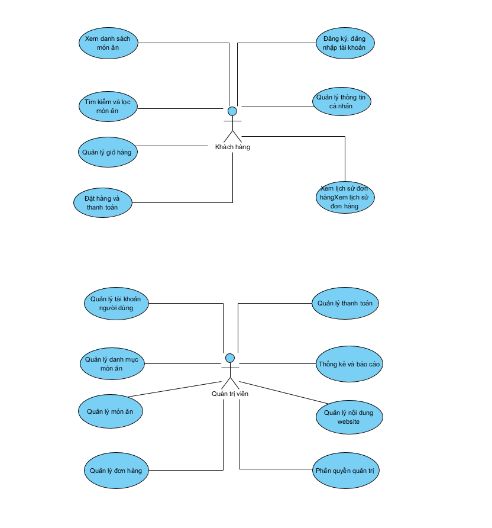

# Phân Tích Thiết Kế Hệ Thống Web Food


## 1. Giới Thiệu
### 1.1 Giới thiệu đề tài
Trong bối cảnh cuộc sống hiện đại với nhịp độ nhanh chóng, việc đặt đồ ăn trực tuyến đã trở thành một nhu cầu thiết yếu của xã hội. Với sự phát triển mạnh mẽ của công nghệ thông tin và thương mại điện tử, các hệ thống đặt món ăn online không chỉ giúp người dùng tiết kiệm thời gian mà còn tạo cơ hội kinh doanh cho các nhà hàng. Đề tài này được chọn nhằm xây dựng một nền tảng toàn diện, dễ sử dụng, kết hợp giữa giao diện thân thiện với người dùng và hệ thống quản lý hiệu quả cho nhà quản trị, góp phần thúc đẩy xu hướng số hóa trong ngành dịch vụ ăn uống.


### 1.2 Mô tả bài toán
Bài toán chính: Trong bối cảnh phát triển thương mại điện tử và xu hướng tiêu dùng online ngày càng phổ biến, đặc biệt là lĩnh vực dịch vụ ăn uống, nhu cầu xây dựng một hệ thống đặt đồ ăn trực tuyến hiệu quả, an toàn và thân thiện với người dùng trở nên cấp thiết. Hệ thống cần giải quyết các vấn đề sau:

Quản lý người dùng và bảo mật: Đảm bảo xác thực người dùng qua email, bảo vệ thông tin cá nhân, và phân quyền rõ ràng giữa khách hàng và quản trị viên.
Quản lý sản phẩm và danh mục: Cho phép hiển thị, tìm kiếm, và quản lý món ăn cùng danh mục một cách dễ dàng.
Quy trình đặt hàng: Tạo trải nghiệm đặt hàng liền mạch từ xem menu, thêm vào giỏ hàng, đến thanh toán và theo dõi đơn hàng.
Giao tiếp và hỗ trợ: Cung cấp kênh chat giữa khách hàng và admin để giải quyết vấn đề kịp thời.
Quản trị hệ thống: Admin cần công cụ để quản lý đơn hàng, món ăn, danh mục, và người dùng một cách hiệu quả.
Hệ thống phải đảm bảo tính bảo mật (chống SQL injection, hash mật khẩu), hiệu suất (tải nhanh, giao diện responsive), và khả năng mở rộng (thêm tính năng như thanh toán online, đánh giá sản phẩm).

## 2. Mô tả tổng quan
Website bán đồ ăn là một hệ thống ứng dụng web được xây dựng nhằm phục vụ nhu cầu đặt món và quản lý hoạt động kinh doanh ẩm thực trong môi trường trực tuyến. Hệ thống cho phép khách hàng truy cập, xem thực đơn, lựa chọn món ăn, đặt hàng và theo dõi trạng thái đơn hàng một cách nhanh chóng và thuận tiện thông qua trình duyệt web

Về phía người dùng, website hỗ trợ các chức năng cơ bản như đăng ký và đăng nhập tài khoản, tìm kiếm và xem chi tiết món ăn, quản lý giỏ hàng, thực hiện đặt hàng và lựa chọn phương thức thanh toán phù hợp. Thông tin đơn hàng sau khi được tạo sẽ được lưu trữ và cập nhật liên tục, giúp khách hàng dễ dàng theo dõi quá trình xử lý và giao hàng.

Về phía quản trị viên, hệ thống cung cấp các công cụ quản lý toàn diện bao gồm quản lý danh mục và món ăn, quản lý đơn hàng, quản lý người dùng và thống kê doanh thu. Các chức năng này giúp người quản lý kiểm soát hiệu quả hoạt động kinh doanh, giảm thiểu sai sót trong quá trình xử lý đơn và nâng cao chất lượng dịch vụ.

Website được thiết kế theo mô hình  client–server , kết hợp với cơ sở dữ liệu để lưu trữ và xử lý dữ liệu. Hệ thống chú trọng đến các yếu tố như  tính bảo mật, độ ổn định, hiệu năng và khả năng mở rộng , đảm bảo đáp ứng tốt nhu cầu sử dụng thực tế và có thể phát triển trong tương lai, chẳng hạn như tích hợp thanh toán trực tuyến hoặc dịch vụ giao hàng.
### 2.1 Tổng quan hệ thống
### 2.2 Xác định các tác nhân
### 2.3 Xác định yêu cầu hệ thống
#### 2.3.1 Yêu cầu chức năng
#### 2.3.2 Yêu cầu phi chức năng
## 3. Luồng màn hình
### 3.1 Mô tả màn hình

| STT | Màn hình                  | Mô tả                                                                                                                                          |
| --- | --------------------------- | ------------------------------------------------------------------------------------------------------------------------------------------------ |
| 1   | Trang chủ                  | Người dùng xem các món ăn hiển thị trên màn hình, tìm kiếm món ăn, nhập email liên hệ và điều hướng sang các trang khác |
| 2   | Danh sách món ăn         | Hiển thị các món ăn theo danh mục; bộ lọc theo loại món, giá, mức độ phổ biến                                                    |
| 3   | Chi tiết món ăn          | Hiển thị tên món, mã món, giá, hình ảnh, mô tả, thành phần, số lượng còn lại                                                   |
| 4   | Giỏ hàng                  | Danh sách món ăn đã chọn, số lượng, tổng tiền, thông tin khách hàng, phương thức thanh toán                                    |
| 5   | Theo dõi đơn             | Hiển thị tình trạng đơn hàng đang được xử lý (đang chuẩn bị, đang giao, hoàn thành)                                           |
| 6   | Liên hệ                   | Thông tin admin/cửa hàng: số điện thoại, email, địa chỉ                                                                                |
| 7   | Đăng nhập                | Nhân viên và admin đăng nhập vào hệ thống                                                                                               |
| 8   | Đăng ký                  | Nhân viên đăng ký tài khoản                                                                                                               |
| 9   | Quên mật khẩu            | Nhập email để nhận mã xác thực                                                                                                            |
| 10  | OTP                         | Nhập mã OTP để xác thực                                                                                                                    |
| 11  | Đổi mật khẩu            | Nhập thông tin cần thiết để đổi mật khẩu                                                                                               |
| 12  | Quản lý danh mục         | Xem trạng thái, người tạo, tìm kiếm; thao tác thêm, sửa, xóa danh mục món ăn                                                       |
| 13  | Tổng quan                  | Thống kê người dùng, doanh thu, số đơn hàng, biểu đồ doanh thu, đơn hàng mới                                                     |
| 14  | Tạo danh mục              | Tạo danh mục món ăn mới: tên, danh mục cha, vị trí, trạng thái, ảnh, mô tả                                                         |
| 15  | Chỉnh sửa danh mục       | Cập nhật thông tin danh mục món ăn                                                                                                         |
| 16  | Thông tin liên hệ        | Danh sách email khách hàng và ngày tạo                                                                                                     |
| 17  | Quản lý đơn hàng       | Tìm kiếm, xem thông tin đơn hàng: mã đơn, khách hàng, món ăn, thanh toán, trạng thái                                             |
| 18  | Chỉnh sửa đơn hàng     | Sửa tên khách, số điện thoại, ghi chú, phương thức thanh toán, trạng thái đơn                                                    |
| 19  | Quản lý món ăn          | Tìm kiếm, tạo mới, sửa, xóa món ăn; xem người tạo/cập nhật, giá, trạng thái                                                      |
| 20  | Tạo mới món ăn          | Nhập thông tin món ăn: tên, danh mục, giá, số lượng, hình ảnh, mô tả                                                               |
| 21  | Thùng rác                 | Danh sách món ăn đã xóa và chức năng khôi phục                                                                                        |
| 22  | Cài đặt chung            | Quản lý thông tin website, tài khoản và nhóm quyền                                                                                       |
| 23  | Thông tin website          | Chỉnh sửa tên website, số điện thoại, email, địa chỉ, logo, favicon                                                                    |
| 24  | Quản trị tài khoản      | Danh sách nhân viên: số điện thoại, nhóm quyền, chức vụ                                                                               |
| 25  | Tạo tài khoản quản trị | Nhập họ tên, email, số điện thoại, nhóm quyền, chức vụ, trạng thái, mật khẩu                                                      |
| 26  | Nhóm quyền                | Danh sách nhóm quyền và mô tả                                                                                                              |
| 27  | Tạo nhóm quyền           | Thêm nhóm quyền mới                                                                                                                          |
| 28  | Chỉnh sửa nhóm quyền    | Chỉnh sửa tên nhóm quyền, mô tả và phân quyền                                                                                          |
| 29  | Thông tin cá nhân        | Quản lý thông tin cá nhân nhân viên                                                                                                       |

### 3.2 Các chức năng hệ thống


### 3.2.1 Chức năng phía khách hàng


Khách hàng là người trực tiếp sử dụng website để xem và đặt món ăn. Hệ thống cung cấp các chức năng sau:

### Xem danh sách món ăn

Hiển thị các món ăn kèm hình ảnh, tên món, giá bán, mô tả và trạng thái còn/hết món.


### Tìm kiếm và lọc món ăn

Cho phép người dùng tìm kiếm món ăn theo tên, loại món (đồ ăn nhanh, đồ uống, combo, …), khoảng giá.

### Quản lý giỏ hàng

Thêm, sửa số lượng, xóa món ăn trong giỏ hàng và xem tổng tiền tạm tính.

### Đặt hàng và thanh toán

Cho phép khách hàng nhập thông tin giao hàng, lựa chọn phương thức thanh toán (tiền mặt, chuyển khoản, ví điện tử, …) và xác nhận đơn hàng.

### Đăng ký, đăng nhập tài khoản

Khách hàng có thể tạo tài khoản để lưu thông tin cá nhân và lịch sử mua hàng.

### Quản lý thông tin cá nhân

Cập nhật thông tin cá nhân như tên, số điện thoại, địa chỉ giao hàng.

### Xem lịch sử đơn hàng

Cho phép khách hàng theo dõi trạng thái và xem lại các đơn hàng đã đặt.

---

#### 3.2.2 Chức năng phía quản trị viên

Quản trị viên là người quản lý toàn bộ hoạt động của hệ thống. Các chức năng chính bao gồm:

### Quản lý tài khoản người dùng

Xem, thêm, sửa, khóa hoặc xóa tài khoản khách hàng.

### Quản lý danh mục món ăn

Thêm, chỉnh sửa, xóa các danh mục món ăn (đồ ăn, đồ uống, combo, …).

### Quản lý món ăn

Thêm mới, cập nhật thông tin, giá bán, hình ảnh và trạng thái của món ăn.

### Quản lý đơn hàng

Xem danh sách đơn hàng, cập nhật trạng thái đơn hàng (chờ xác nhận, đang giao, đã giao, hủy).

### Quản lý thanh toán

Theo dõi tình trạng thanh toán của các đơn hàng.

### Thống kê và báo cáo

Thống kê doanh thu theo ngày, tháng, năm; số lượng đơn hàng; các món ăn bán chạy.

### Quản lý nội dung website

Cập nhật banner, thông tin giới thiệu, chính sách bán hàng.

### Phân quyền quản trị

Phân quyền cho các tài khoản quản trị (admin, nhân viên).

### 3.3 Biểu đồ mô tả hệ thống

#### 3.2.1 Use Case Diagram

#### Use case tổng quát hệ thống
!

---

## 4. Tổng quan về phần mềm

### 4.1 Kiến trúc hệ thống

*Liệt kê các bảng chính và mối quan hệ*

```
Users
├── id (PK)
├── email
├── password_hash
├── phone
├── address
├── created_at
└── updated_at

Restaurants
├── id (PK)
├── name
├── owner_id (FK → Users)
├── address
├── rating
└── created_at

MenuItems
├── id (PK)
├── restaurant_id (FK → Restaurants)
├── name
├── price
├── description
└── image_url

Orders
├── id (PK)
├── user_id (FK → Users)
├── restaurant_id (FK → Restaurants)
├── total_amount
├── status
└── created_at

OrderDetails
├── id (PK)
├── order_id (FK → Orders)
├── menu_item_id (FK → MenuItems)
└── quantity
```

### 4.2 Luồng hoạt động phần mềm


### 4.3 Các Ràng Buộc (Constraints)

*Mô tả primary key, foreign key, unique constraints*

---

## 5. Thiết Kế Phần Mềm 

## 5.1 Thiết kế chức năng phía người dùng

### 5.1.1. Quản lý tài khoản người dùng

#### 1. Đăng ký tài khoản
**Mô tả:** Người dùng có thể đăng ký tài khoản mới để sử dụng hệ thống.

**Chức năng:**
- Form đăng ký với các trường: Họ tên, Email (chỉ chấp nhận Gmail), Mật khẩu, Xác nhận mật khẩu, Số điện thoại, Địa chỉ
- Validation dữ liệu đầu vào:
  - Email phải là định dạng Gmail (@gmail.com)
  - Mật khẩu tối thiểu 6 ký tự
  - Mật khẩu và xác nhận mật khẩu phải khớp
- Xác minh email qua mã 6 số:
  - Tạo mã xác minh ngẫu nhiên 6 chữ số
  - Gửi mã qua email sử dụng PHPMailer (Gmail SMTP)
  - Mã có thời hạn 10 phút
  - Lưu mã vào database với trạng thái chưa xác minh
- Hash mật khẩu bằng `password_hash()` trước khi lưu vào database
- Kiểm tra email đã tồn tại trong hệ thống

**Luồng xử lý:**
```
Người dùng nhập thông tin → Validate → Kiểm tra email tồn tại → 
Tạo mã OTP → Gửi email → Lưu thông tin tạm vào session → 
Chuyển đến trang xác minh → Nhập mã OTP → Xác minh → 
Tạo tài khoản → Đăng nhập tự động
```

#### 2. Đăng nhập
**Mô tả:** Người dùng đăng nhập vào hệ thống bằng email và mật khẩu.

**Chức năng:**
- Form đăng nhập với Email và Mật khẩu
- Xác thực thông tin đăng nhập:
  - Kiểm tra email tồn tại trong database
  - Kiểm tra tài khoản có trạng thái Active
  - Xác thực mật khẩu bằng `password_verify()`
- Lưu thông tin user vào session:
  - `user_id` - ID người dùng
  - `user` - Tên đăng nhập
  - `user_full_name` - Họ tên đầy đủ
- Redirect thông minh:
  - Nếu có `redirect_food_id` trong session → chuyển đến trang đặt hàng
  - Ngược lại → chuyển về trang chủ
- Hiển thị thông báo lỗi nếu đăng nhập thất bại

#### 3. Quên mật khẩu
**Mô tả:** Người dùng có thể khôi phục mật khẩu nếu quên.

**Chức năng:**
- Form nhập email để yêu cầu đặt lại mật khẩu
- Gửi mã xác minh 6 số qua email
- Giới hạn số lần thử nhập mã (5 lần)
- Mã xác minh có thời hạn 10 phút
- Form đặt lại mật khẩu mới sau khi xác minh thành công
- Hash mật khẩu mới trước khi cập nhật

**Luồng xử lý:**
```
Nhập email → Gửi mã OTP → Nhập mã → Xác minh → 
Đặt mật khẩu mới → Cập nhật database → Thông báo thành công
```

#### 4. Đăng xuất
**Mô tả:** Người dùng có thể đăng xuất khỏi hệ thống.

**Chức năng:**
- Xóa tất cả session của người dùng
- Chuyển hướng về trang chủ
- Hiển thị thông báo đăng xuất thành công

---
### 5.1.2. Duyệt và tìm kiếm món ăn

#### 1. Trang chủ
**Mô tả:** Hiển thị thông tin tổng quan về hệ thống và món ăn nổi bật.

**Chức năng:**
- Hiển thị form tìm kiếm món ăn
- Hiển thị 3 danh mục đầu tiên với hình ảnh
- Hiển thị 6 món ăn đầu tiên trong menu
- Mỗi món ăn hiển thị: Tên, Giá, Mô tả, Hình ảnh
- Nút "Thêm vào giỏ" nếu đã đăng nhập, "Đặt ngay" nếu chưa đăng nhập
- Link "Xem tất cả món ăn" để xem toàn bộ menu

#### 2. Xem danh sách món ăn
**Mô tả:** Hiển thị toàn bộ món ăn trong hệ thống.

**Chức năng:**
- Hiển thị tất cả món ăn có trong database
- Mỗi món ăn hiển thị đầy đủ thông tin: Tên, Giá, Mô tả, Hình ảnh
- Nút thêm vào giỏ hàng (yêu cầu đăng nhập)
- Responsive design cho mobile

#### 3. Xem món ăn theo danh mục
**Mô tả:** Lọc và hiển thị món ăn theo từng danh mục.

**Chức năng:**
- Hiển thị danh sách tất cả danh mục
- Khi click vào danh mục, hiển thị các món ăn thuộc danh mục đó
- Hiển thị thông báo nếu danh mục chưa có món ăn

#### 4. Tìm kiếm món ăn
**Mô tả:** Tìm kiếm món ăn theo từ khóa.

**Chức năng:**
- Form tìm kiếm với ô nhập từ khóa
- Tìm kiếm trong tên món ăn (`title`) và mô tả (`description`)
- Hiển thị kết quả tìm kiếm với đầy đủ thông tin món ăn
- Hiển thị thông báo nếu không tìm thấy kết quả

**Luồng xử lý:**
```
Nhập từ khóa → Submit form → Query database → 
Hiển thị kết quả tìm kiếm
```

---
### 5.1.3. Quản lý giỏ hàng

#### 1. Thêm món vào giỏ hàng
**Mô tả:** Người dùng có thể thêm món ăn vào giỏ hàng.

**Chức năng:**
- Nút "Thêm vào giỏ" trên mỗi món ăn
- Yêu cầu đăng nhập trước khi thêm vào giỏ
- Thêm món vào giỏ hàng qua AJAX (không reload trang)
- Hiển thị thông báo thành công khi thêm vào giỏ
- Cập nhật số lượng món trong giỏ hàng (badge)
- Nếu món đã có trong giỏ, tăng số lượng thay vì tạo mới

#### 2. Xem giỏ hàng
**Mô tả:** Hiển thị danh sách món ăn trong giỏ hàng.

**Chức năng:**
- Hiển thị danh sách món ăn trong giỏ hàng:
  - Hình ảnh món ăn
  - Tên món ăn
  - Giá đơn vị
  - Số lượng (có thể tăng/giảm)
  - Ghi chú cho món ăn (VD: ăn cay, không cay, nhiều, ít...)
  - Tổng tiền cho mỗi món
- Tính tổng tiền toàn bộ giỏ hàng
- Nút tăng/giảm số lượng
- Nút xóa món khỏi giỏ hàng
- Ô nhập ghi chú cho từng món
- Nút "Thanh toán" để chuyển đến trang checkout
- Hiển thị thông báo nếu giỏ hàng trống

**Luồng xử lý:**
```
Load trang → Gọi API get-cart.php → Hiển thị danh sách món → 
Tính tổng tiền → Hiển thị nút thanh toán
```

---

### 5.1.4. Đặt hàng và thanh toán

#### 1. Thanh toán (Checkout)
**Mô tả:** Người dùng điền thông tin giao hàng và xác nhận đặt hàng.

**Chức năng:**
- Form nhập thông tin giao hàng:
  - Họ tên người nhận (tự động điền từ thông tin user)
  - Số điện thoại (tự động điền)
  - Email (tự động điền)
  - Địa chỉ giao hàng (tự động điền)
- Hiển thị tóm tắt đơn hàng:
  - Danh sách món ăn, số lượng, ghi chú
  - Tổng tiền đơn hàng
- Chọn phương thức thanh toán:
  - Tiền mặt (COD)
  - Thanh toán online
- Tạo mã đơn hàng duy nhất:
  - Format: `ORD` + `YYYYMMDD` + `6 ký tự ngẫu nhiên`
  - Ví dụ: `ORD20241215ABC123`
- Xử lý đặt hàng:
  - Tạo đơn hàng cho từng món trong giỏ
  - Lưu thông tin đơn hàng vào database
  - Xóa giỏ hàng sau khi đặt hàng thành công
  - Nếu thanh toán online → chuyển đến trang payment
  - Nếu thanh toán tiền mặt → chuyển đến trang lịch sử đơn hàng

**Luồng xử lý:**
```
Xem giỏ hàng → Click "Thanh toán" → Điền thông tin giao hàng → 
Chọn phương thức thanh toán → Xác nhận đặt hàng → 
Tạo mã đơn hàng → Lưu vào database → Xóa giỏ hàng → 
Chuyển đến trang phù hợp
```

#### 2. Lịch sử đặt hàng
**Mô tả:** Người dùng xem lịch sử các đơn hàng đã đặt.

**Chức năng:**
- Hiển thị danh sách đơn hàng của user:
  - Mã đơn hàng (có nút copy)
  - Ngày đặt hàng
  - Trạng thái đơn hàng (màu sắc khác nhau):
    - Đã đặt hàng (Ordered) - màu vàng
    - Đang giao hàng (On Delivery) - màu cam
    - Đã giao hàng (Delivered) - màu xanh lá
    - Đã hủy (Cancelled) - màu đỏ
  - Thông tin món ăn: Tên, Số lượng, Đơn giá, Tổng tiền
  - Thông tin giao hàng: Tên người nhận, Địa chỉ
- Nút "Chat hỗ trợ đơn này" để liên hệ admin về đơn hàng cụ thể
- Hiển thị thông báo nếu chưa có đơn hàng nào

---

### 5.1.5. Hệ thống chat với Admin

#### 1. Chat với Admin
**Mô tả:** Người dùng có thể chat với admin để được hỗ trợ.

**Chức năng:**
- Giao diện chat real-time:
  - Hiển thị tin nhắn đã gửi/nhận
  - Phân biệt tin nhắn của user và admin (màu sắc khác nhau)
  - Hiển thị thời gian gửi tin nhắn
  - Tự động scroll xuống tin nhắn mới nhất
- Gửi tin nhắn:
  - Form nhập tin nhắn
  - Gửi tin nhắn qua AJAX (không reload trang)
  - Hiển thị tin nhắn ngay sau khi gửi
- Nhận tin nhắn:
  - Polling mỗi 2 giây để lấy tin nhắn mới
  - Tự động hiển thị tin nhắn mới từ admin
  - Đánh dấu tin nhắn đã đọc khi mở trang chat
- Chat về đơn hàng cụ thể:
  - Có thể truyền `order_code` qua URL
  - Hiển thị thông báo về đơn hàng đang chat
  - Nút chèn mã đơn hàng vào tin nhắn
- Badge thông báo số tin nhắn chưa đọc (trong menu)

**Luồng xử lý:**
```
Mở trang chat → Load tin nhắn cũ → Bắt đầu polling → 
Gửi tin nhắn → Lưu vào database → Hiển thị ngay → 
Admin trả lời → Polling phát hiện tin nhắn mới → Hiển thị
```
--- 
## 5.2 Thiết kế chức năng phía quản trị viên

---
## 6. Bảo Mật
Hệ thống Web Food được xây dựng nhằm phục vụ hoạt động đặt món ăn trực tuyến, quản lý đơn hàng và hỗ trợ khách hàng. Cơ sở dữ liệu **food-order** được thiết kế trên nền tảng MariaDB/MySQL, đáp ứng các yêu cầu lưu trữ, truy xuất và đảm bảo tính toàn vẹn dữ liệu.

Các nhóm dữ liệu chính trong hệ thống bao gồm:

* **Dữ liệu quản trị viên** : phục vụ cho việc quản lý hệ thống, theo dõi và xử lý các yêu cầu từ người dùng.
* **Dữ liệu người dùng** : lưu trữ thông tin tài khoản khách hàng đăng ký sử dụng dịch vụ.
* **Dữ liệu danh mục món ăn** : hỗ trợ phân loại món ăn theo từng nhóm cụ thể.
* **Dữ liệu món ăn** : quản lý thông tin chi tiết của các món được cung cấp trên hệ thống.
* **Dữ liệu đơn hàng** : ghi nhận quá trình đặt món, trạng thái và thông tin giao hàng.
* **Dữ liệu trò chuyện** : lưu lịch sử trao đổi giữa khách hàng và quản trị viên nhằm hỗ trợ và giải đáp thắc mắc.

Cách tổ chức dữ liệu theo mô hình quan hệ giúp hệ thống vận hành ổn định, dễ bảo trì và thuận tiện cho việc mở rộng trong tương lai.

### 6.2 Biểu đồ ER (Entity – Relationship)

Dựa trên cơ sở dữ liệu hiện tại, hệ thống bao gồm các thực thể chính sau:

1. **Quản trị viên (tbl_admin)**
   * id (khóa chính)
   * full_name
   * email
   * username
   * password
2. **Người dùng (tbl_user)**
   * id (khóa chính)
   * full_name
   * username (duy nhất)
   * password
   * email (duy nhất)
   * phone
   * address
   * status
   * created_at
3. **Danh mục (tbl_category)**
   * id (khóa chính)
   * title
   * featured
   * active
   * image_name
4. **Món ăn (tbl_food)**
   * id (khóa chính)
   * title
   * description
   * price
   * image_name
   * category_id (khóa ngoại)
   * featured
   * active
5. **Đơn hàng (tbl_order)**
   * id (khóa chính)
   * order_code (duy nhất)
   * user_id (khóa ngoại)
   * food
   * price
   * qty
   * total
   * order_date
   * status
   * customer_name
   * customer_contact
   * customer_email
   * customer_address
6. **Trò chuyện (tbl_chat)**
   * id (khóa chính)
   * user_id (khóa ngoại)
   * admin_id (khóa ngoại)
   * sender_type
   * message
   * is_read
   * created_at

**Các mối quan hệ giữa các thực thể:**

* Một người dùng có thể phát sinh nhiều đơn hàng.
* Người dùng và quản trị viên có thể trao đổi nhiều tin nhắn thông qua chức năng chat.
* Mỗi danh mục có thể chứa nhiều món ăn khác nhau.

### 6.3 Thiết kế dữ liệu (Lược đồ quan hệ)

Các bảng dữ liệu trong hệ thống được thiết kế như sau:

* **TBL_ADMIN** (id PK, full_name, email, username, password)
* **TBL_USER** (id PK, full_name, username UQ, password, email UQ, phone, address, status, created_at)
* **TBL_CATEGORY** (id PK, title, featured, active, image_name)
* **TBL_FOOD** (id PK, title, description, price, image_name, category_id FK, featured, active)
* **TBL_ORDER** (id PK, order_code UQ, user_id FK, food, price, qty, total, order_date, status, customer_name, customer_contact, customer_email, customer_address)
* **TBL_CHAT** (id PK, user_id FK, admin_id FK, sender_type, message, is_read, created_at)

Các ràng buộc khóa ngoại được thiết lập nhằm đảm bảo tính toàn vẹn dữ liệu, đồng thời hỗ trợ kiểm soát mối quan hệ giữa các bảng.

### 6.4 Sơ đồ ERD

Sơ đồ ERD thể hiện rõ cấu trúc tổng thể của cơ sở dữ liệu và mối liên hệ giữa các bảng. Người dùng liên kết với bảng đơn hàng và bảng trò chuyện; quản trị viên tham gia vào quá trình trao đổi hỗ trợ; danh mục đóng vai trò phân loại cho các món ăn.

Mặc dù thiết kế hiện tại đáp ứng tốt nhu cầu của hệ thống, tuy nhiên bảng đơn hàng vẫn lưu trực tiếp tên món ăn thay vì liên kết khóa ngoại tới bảng món ăn. Điều này có thể gây khó khăn trong việc mở rộng và chuẩn hóa dữ liệu khi hệ thống phát triển lớn hơn.

**Kết luận:**
Thiết kế dữ liệu của hệ thống Web Food được xây dựng phù hợp với yêu cầu nghiệp vụ thực tế, đảm bảo khả năng quản lý, truy xuất và vận hành ổn định. Trong giai đoạn tiếp theo, hệ thống có thể được cải tiến bằng cách chuẩn hóa sâu hơn cấu trúc cơ sở dữ liệu nhằm nâng cao hiệu quả và tính mở rộng.


