# Phân Tích Thiết Kế Hệ Thống Web Food

## 1. Giới Thiệu

### 1.1 Giới thiệu đề tài

Trong bối cảnh cuộc sống hiện đại với nhịp độ nhanh chóng, việc đặt đồ ăn trực tuyến đã trở thành một nhu cầu thiết yếu của xã hội. Với sự phát triển mạnh mẽ của công nghệ thông tin và thương mại điện tử, các hệ thống đặt món ăn online không chỉ giúp người dùng tiết kiệm thời gian mà còn tạo cơ hội kinh doanh cho các nhà hàng. Đề tài này được chọn nhằm xây dựng một nền tảng toàn diện, dễ sử dụng, kết hợp giữa giao diện thân thiện với người dùng và hệ thống quản lý hiệu quả cho nhà quản trị, góp phần thúc đẩy xu hướng số hóa trong ngành dịch vụ ăn uống.

### 1.2 Mô tả bài toán

Bài toán chính: Trong bối cảnh phát triển thương mại điện tử và xu hướng tiêu dùng online ngày càng phổ biến, đặc biệt là lĩnh vực dịch vụ ăn uống, nhu cầu xây dựng một hệ thống đặt đồ ăn trực tuyến hiệu quả, an toàn và thân thiện với người dùng trở nên cấp thiết. Hệ thống cần giải quyết các vấn đề sau:

Quản lý người dùng và bảo mật: Đảm bảo xác thực người dùng qua email, bảo vệ thông tin cá nhân, và phân quyền rõ ràng giữa khách hàng và quản trị viên.
Quản lý sản phẩm và danh mục: Cho phép hiển thị, tìm kiếm, và quản lý món ăn cùng danh mục một cách dễ dàng.
Quy trình đặt hàng: Tạo trải nghiệm đặt hàng liền mạch từ xem menu, thêm vào giỏ hàng, đến thanh toán và theo dõi đơn hàng.
Giao tiếp và hỗ trợ: Cung cấp kênh chat giữa khách hàng và admin để giải quyết vấn đề kịp thời.
Quản trị hệ thống: Admin cần công cụ để quản lý đơn hàng, món ăn, danh mục, và người dùng một cách hiệu quả.
Hệ thống phải đảm bảo tính bảo mật (chống SQL injection, hash mật khẩu), hiệu suất (tải nhanh, giao diện responsive), và khả năng mở rộng (thêm tính năng như thanh toán online, đánh giá sản phẩm).

## 2. Mô tả tổng quan

### 2.1 Tổng quan hệ thống

Hệ thống web bán đồ ăn là một ứng dụng thương mại điện tử cho phép người dùng đặt món ăn trực tuyến thông qua trình duyệt web. Hệ thống hỗ trợ khách hàng xem menu, tìm kiếm món ăn, đặt hàng và theo dõi trạng thái đơn hàng một cách nhanh chóng và thuận tiện.

Trong bối cảnh thương mại điện tử và xu hướng tiêu dùng online ngày càng phát triển, đặc biệt trong lĩnh vực dịch vụ ăn uống, việc xây dựng một hệ thống đặt đồ ăn trực tuyến hiệu quả, an toàn và thân thiện với người dùng là nhu cầu cấp thiết. Hệ thống không chỉ giúp khách hàng tiết kiệm thời gian mà còn hỗ trợ doanh nghiệp quản lý hoạt động kinh doanh một cách hiệu quả hơn.

### 2.2 Xác định các tác nhân

Hệ thống web bán đồ ăn phục vụ cho các đối tượng chính sau:

- Khách hàng có nhu cầu đặt món ăn trực tuyến.
- Quản trị viên quản lý hệ thống

#### 2.2.1. Khách hàng

Khách hàng là người sử dụng hệ thống để:
Đăng ký, đăng nhập tài khoản.
Xem danh mục và danh sách món ăn.
Tìm kiếm, lựa chọn món ăn và thêm vào giỏ hàng.
Đặt hàng, thanh toán và theo dõi trạng thái đơn hàng.
Trao đổi với quản trị viên thông qua chức năng chat khi cần hỗ trợ.

#### 2.2.2. Quản trị viên

Quản trị viên là người quản lý toàn bộ hệ thống, có các chức năng:
Quản lý người dùng và phân quyền.
Quản lý danh mục và món ăn (thêm, sửa, xóa).
Quản lý đơn hàng và cập nhật trạng thái xử lý.
Theo dõi hoạt động hệ thống và hỗ trợ khách hàng.
Đảm bảo an toàn và ổn định cho hệ thống.

### 3.1 Mô tả màn hình

| STT   | Màn hình                  | Mô tả                                                                                                                                          |
| ----- | --------------------------- | ------------------------------------------------------------------------------------------------------------------------------------------------ |
| 1     | Trang chủ                  | Người dùng xem các món ăn hiển thị trên màn hình, tìm kiếm món ăn, nhập email liên hệ và điều hướng sang các trang khác |
| 2     | Danh sách món ăn         | Hiển thị các món ăn theo danh mục; bộ lọc theo loại món, giá, mức độ phổ biến                                                    |
| 3     | Chi tiết món ăn          | Hiển thị tên món, mã món, giá, hình ảnh, mô tả, thành phần, số lượng còn lại                                                   |
| 4     | Giỏ hàng                  | Danh sách món ăn đã chọn, số lượng, tổng tiền, thông tin khách hàng, phương thức thanh toán                                    |
| 5     | Theo dõi đơn             | Hiển thị tình trạng đơn hàng đang được xử lý (đang chuẩn bị, đang giao, hoàn thành)                                           |
| 6     | Liên hệ                   | Thông tin admin/cửa hàng: số điện thoại, email, địa chỉ                                                                                |
| 7     | Đăng nhập                | Nhân viên và admin đăng nhập vào hệ thống                                                                                               |
| 8     | Đăng ký                  | Nhân viên đăng ký tài khoản                                                                                                               |
| 9     | Quên mật khẩu            | Nhập email để nhận mã xác thực                                                                                                            |
| 10    | OTP                         | Nhập mã OTP để xác thực                                                                                                                    |
| 11    | Đổi mật khẩu            | Nhập thông tin cần thiết để đổi mật khẩu                                                                                               |
| 12    | Quản lý danh mục         | Xem trạng thái, người tạo, tìm kiếm; thao tác thêm, sửa, xóa danh mục món ăn                                                       |
| 13    | Tổng quan                  | Thống kê người dùng, doanh thu, số đơn hàng, biểu đồ doanh thu, đơn hàng mới                                                     |
| 14    | Tạo danh mục              | Tạo danh mục món ăn mới: tên, danh mục cha, vị trí, trạng thái, ảnh, mô tả                                                         |
| 15    | Chỉnh sửa danh mục       | Cập nhật thông tin danh mục món ăn                                                                                                         |
| 16    | Thông tin liên hệ        | Danh sách email khách hàng và ngày tạo                                                                                                     |
| 17    | Quản lý đơn hàng       | Tìm kiếm, xem thông tin đơn hàng: mã đơn, khách hàng, món ăn, thanh toán, trạng thái                                             |
| 18    | Chỉnh sửa đơn hàng     | Sửa tên khách, số điện thoại, ghi chú, phương thức thanh toán, trạng thái đơn                                                    |
| 19    | Quản lý món ăn          | Tìm kiếm, tạo mới, sửa, xóa món ăn; xem người tạo/cập nhật, giá, trạng thái                                                      |
| 20    | Tạo mới món ăn          | Nhập thông tin món ăn: tên, danh mục, giá, số lượng, hình ảnh, mô tả                                                               |
| phục |                             |                                                                                                                                                  |
| 22    | Cài đặt chung            | Quản lý thông tin website, tài khoản và nhóm quyền                                                                                       |
| 23    | Thông tin website          | Chỉnh sửa tên website, số điện thoại, email, địa chỉ, logo, favicon                                                                    |
| 24    | Quản trị tài khoản      | Danh sách nhân viên: số điện thoại, nhóm quyền, chức vụ                                                                               |
| 25    | Tạo tài khoản quản trị | Nhập họ tên, email, số điện thoại, nhóm quyền, chức vụ, trạng thái, mật khẩu                                                      |
| 26    | Nhóm quyền                | Danh sách nhóm quyền và mô tả                                                                                                              |
| 27    | Tạo nhóm quyền           | Thêm nhóm quyền mới                                                                                                                          |
| 28    | Chỉnh sửa nhóm quyền    | Chỉnh sửa tên nhóm quyền, mô tả và phân quyền                                                                                          |
| 29    | Thông tin cá nhân        | Quản lý thông tin cá nhân nhân viên                                                                                                       |

---

### 3.2 Các chức năng không liên quan đến màn hình

Ngoài các chức năng được thể hiện trực tiếp thông qua giao diện người dùng, hệ thống website bán đồ ăn còn bao gồm một số chức năng xử lý nền nhằm đảm bảo tính bảo mật, phân quyền và vận hành ổn định của hệ thống.

| STT | Chức năng hệ thống | Mô tả                                                                                                                                                      |
| --- | ---------------------- | ------------------------------------------------------------------------------------------------------------------------------------------------------------ |
| 1   | Gửi OTP               | Hệ thống tự động gửi mã OTP để xác thực người dùng khi đăng ký, đăng nhập, quên mật khẩu hoặc thực hiện các thao tác quan trọng |
| 2   | Quản lý phân quyền | Quản lý và phân quyền truy cập giữa các vai trò trong hệ thống như quản trị viên và nhân viên                                              |

---

### 3.3 Hệ thống cấp quyền

Hệ thống website bán đồ ăn được xây dựng với cơ chế phân quyền rõ ràng nhằm đảm bảo an toàn dữ liệu và giới hạn quyền thao tác của từng nhóm người dùng.
Các quyền cơ bản bao gồm: **Xem, Thêm, Sửa, Xóa, Tìm kiếm và các quyền đặc biệt khác**.

| Màn hình / Chức năng    | Xem | Thêm | Sửa | Xóa | Tìm kiếm | Khác |
| --------------------------- | :-: | :---: | :--: | :--: | :--------: | ----- |
| Trang chủ                  |  x  |      |      |      |     x     |       |
| Danh sách món ăn         |  x  |      |      |      |     x     |       |
| Chi tiết món ăn          |  x  |      |      |      |            |       |
| Giỏ hàng                  |  x  |   x   |      |      |            |       |
| Theo dõi đơn hàng       |  x  |      |      |      |            |       |
| Liên hệ                   |  x  |      |      |      |            |       |
| Đăng nhập                |  x  |   x   |      |      |            |       |
| Đăng ký                  |  x  |   x   |      |      |            |       |
| Quên mật khẩu            |  x  |   x   |      |      |            |       |
| OTP                         |  x  |   x   |      |      |            |       |
| Đổi mật khẩu            |  x  |      |  x  |      |            |       |
| Tổng quan (Dashboard)      |  x  |      |      |      |            |       |
| Quản lý danh mục         |  x  |   x   |  x  |  x  |            |       |
| Tạo danh mục              |    |   x   |      |      |            |       |
| Chỉnh sửa danh mục       |    |      |  x  |      |            |       |
| Thông tin liên hệ        |  x  |      |      |      |            |       |
| Quản lý đơn hàng       |  x  |   x   |  x  |  x  |     x     |       |
| Chỉnh sửa đơn hàng     |    |      |  x  |      |            |       |
| Quản lý món ăn          |  x  |   x   |  x  |  x  |     x     |       |
| Cài đặt chung            |  x  |      |  x  |      |            |       |
| Thông tin website          |  x  |      |  x  |      |            |       |
| Quản trị tài khoản      |  x  |      |      |      |            |       |
| Tạo tài khoản quản trị |    |   x   |      |      |            |       |
| Nhóm quyền                |  x  |   x   |  x  |  x  |     x     |       |
| Thông tin cá nhân        |  x  |      |  x  |      |            |       |
| Đổi mật khẩu cá nhân  |  x  |      |  x  |      |            |       |

#### Trong đó

- **Xem**: Cho phép khách hàng hoặc nhân viên xem thông tin hiển thị trên giao diện hoặc các dữ liệu thống kê liên quan.
- **Thêm**: Cho phép khách hàng đặt món ăn; cho phép nhân viên hoặc quản trị viên tạo mới dữ liệu trong hệ thống.
- **Sửa**: Cho phép nhân viên hoặc quản trị viên cập nhật các thông tin đã tồn tại trong hệ thống.
- **Xóa**: Cho phép xóa dữ liệu khỏi hệ thống, thường chỉ áp dụng cho các vai trò có quyền cao.
- **Tìm kiếm**: Cho phép lọc và tìm kiếm dữ liệu theo các tiêu chí khác nhau.
- **Khác**: Bao gồm các quyền đặc biệt như khôi phục dữ liệu, xác thực OTP hoặc các thao tác nâng cao khác.

Hệ thống phân quyền giúp đảm bảo dữ liệu được quản lý chặt chẽ, giảm thiểu rủi ro và nâng cao hiệu quả vận hành website bán đồ ăn.

## 4. Tổng quan về phần mềm

### Các chức năng hệ thống

### 4.1 Chức năng phía khách hàng

Khách hàng là người trực tiếp sử dụng website để xem và đặt món ăn. Hệ thống cung cấp các chức năng sau:

### 4.1.1 Xem danh sách món ăn

Hiển thị các món ăn kèm hình ảnh, tên món, giá bán, mô tả và trạng thái còn/hết món.

### 4.1.2 Tìm kiếm và lọc món ăn

Cho phép người dùng tìm kiếm món ăn theo tên, loại món (đồ ăn nhanh, đồ uống, combo, …), khoảng giá.

### 4.1.3 Quản lý giỏ hàng

Thêm, sửa số lượng, xóa món ăn trong giỏ hàng và xem tổng tiền tạm tính.

### 4.1.4 Đặt hàng và thanh toán

Cho phép khách hàng nhập thông tin giao hàng, lựa chọn phương thức thanh toán (tiền mặt, chuyển khoản, ví điện tử, …) và xác nhận đơn hàng.

### 4.1.5 Đăng ký, đăng nhập tài khoản

Khách hàng có thể tạo tài khoản để lưu thông tin cá nhân và lịch sử mua hàng.

### 4.1.6 Quản lý thông tin cá nhân

Cập nhật thông tin cá nhân như tên, số điện thoại, địa chỉ giao hàng.

### 4.1.7 Xem lịch sử đơn hàng

Cho phép khách hàng theo dõi trạng thái và xem lại các đơn hàng đã đặt.

---

### 4.2 Chức năng phía quản trị viên

Quản trị viên là người quản lý toàn bộ hoạt động của hệ thống. Các chức năng chính bao gồm:

### 4.2.1 Quản lý tài khoản người dùng

Xem, thêm, sửa, khóa hoặc xóa tài khoản khách hàng.

### 4.2.2 Quản lý danh mục món ăn

Thêm, chỉnh sửa, xóa các danh mục món ăn (đồ ăn, đồ uống, combo, …).

### 4.2.3 Quản lý món ăn

Thêm mới, cập nhật thông tin, giá bán, hình ảnh và trạng thái của món ăn.

### 4.2.3 Quản lý đơn hàng

Xem danh sách đơn hàng, cập nhật trạng thái đơn hàng (chờ xác nhận, đang giao, đã giao, hủy).

### 4.2.4 Quản lý thanh toán

Theo dõi tình trạng thanh toán của các đơn hàng.

### 4.2.5 Thống kê và báo cáo

Thống kê doanh thu theo ngày, tháng, năm; số lượng đơn hàng; các món ăn bán chạy.

### 4.2.6 Quản lý nội dung website

Cập nhật banner, thông tin giới thiệu, chính sách bán hàn

### 4.3 Biểu đồ mô tả hệ thống

#### Đặc tả Use Case tổng quan hệ thống

#### 4.3.1 Use Case Diagram

Thể hiện hệ thống làm được gì

#### A) Khách hàng

---

#### B) Quản trị viên

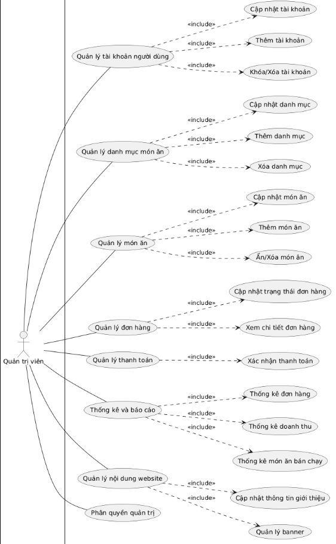

---

##### Đặc tả

| Thuộc tính                 | Mô tả                                                                                                                                                      |
| ---------------------------- | ------------------------------------------------------------------------------------------------------------------------------------------------------------ |
| **Tên Use Case**      | Sử dụng hệ thống Website bán đồ ăn                                                                                                                   |
| **Tác nhân chính**  | Khách hàng                                                                                                                                                 |
| **Tác nhân phụ**    | Quản trị viên                                                                                                                                             |
| **Mô tả**            | Hệ thống cho phép khách hàng xem và đặt món ăn trực tuyến; quản trị viên quản lý món ăn, đơn hàng, người dùng và nội dung website |
| **Tiền điều kiện** | Hệ thống hoạt động bình thường                                                                                                                       |
| **Hậu điều kiện**  | Dữ liệu được lưu trữ và cập nhật chính xác                                                                                                       |
| **Luồng chính**      | Người dùng truy cập website và thực hiện các chức năng phù hợp với vai trò                                                                     |
| **Luồng thay thế**   | Lỗi hệ thống hoặc người dùng chưa đăng nhập                                                                                                       |

#### Chi tiết hệ thống

#### 4.3.2 Sequence Diagram

Thể hiện các đối tượng tương tác với nhau như thế nào theo thời gian

#### A) Khách hàng

#### 1. Xem danh sách món ăn

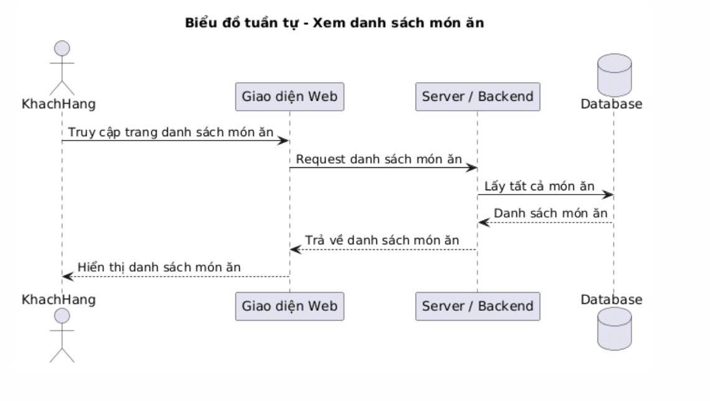

Tên chức năng
  Xem danh sách món ăn
Actor
  Khách hàng
Mô tả
  Chức năng cho phép khách hàng truy cập trang danh sách món ăn và xem toàn bộ các món ăn hiện có trong hệ thống.
Điều kiện tiên quyết
  •	 Hệ thống hoạt động bình thường
  •	 Database đã có dữ liệu món ăn
Luồng chính
  1.	Khách hàng truy cập trang danh sách món ăn.
  2.	Giao diện Web gửi yêu cầu lấy danh sách món ăn đến Server/Backend.
  3.	Server/Backend truy vấn Database để lấy toàn bộ món ăn.
  4.	Database trả về danh sách món ăn cho Server/Backend.
  5.	Server/Backend trả dữ liệu danh sách món ăn cho Giao diện Web.
  6.	Giao diện Web hiển thị danh sách món ăn cho khách hàng.
Hậu điều kiện
  Danh sách món ăn được hiển thị thành công cho khách hàng.

#### 2. Tìm kiếm và lọc món ăn

Tên chức năng
  Tìm kiếm và lọc món ăn
Actor
  Khách hàng
Mô tả
  Chức năng cho phép khách hàng tìm kiếm món ăn theo từ khóa hoặc lọc theo các tiêu chí như loại món, giá, trạng thái.
Điều kiện tiên quyết
  •	Danh sách món ăn đã được tải
  •	Hệ thống có dữ liệu món ăn
Luồng chính
  1.	Khách hàng nhập từ khóa tìm kiếm hoặc chọn bộ lọc.
  2.	Giao diện Web gửi yêu cầu tìm kiếm và lọc đến Server/Backend.
  3.	Server/Backend xử lý yêu cầu và truy vấn Database theo điều kiện.
  4.	Database trả về kết quả tìm kiếm cho Server/Backend.
  5.	Server/Backend trả danh sách món ăn đã lọc cho Giao diện Web.
  6.	Giao diện Web hiển thị kết quả tìm kiếm cho khách hàng.
Hậu điều kiện
  Kết quả tìm kiếm và lọc được hiển thị đúng theo yêu cầu.

#### 3. quản lý giỏ hàng

Tên chức năng
  Quản lý giỏ hàng
Actor
  Khách hàng
Mô tả
  Chức năng cho phép khách hàng thêm, xóa hoặc cập nhật số lượng món ăn trong giỏ hàng.
Điều kiện tiên quyết
  •	Khách hàng đã chọn món ăn
  •	Hệ thống đang hoạt động
Luồng chính
  1.	Khách hàng thực hiện thao tác thêm / xóa / cập nhật món ăn trong giỏ hàng.
  2.	Giao diện Web gửi yêu cầu cập nhật giỏ hàng đến Server/Backend.
  3.	Server/Backend cập nhật dữ liệu giỏ hàng trong Database.
  4.	Database xác nhận cập nhật thành công.
  5.	Server/Backend trả thông tin giỏ hàng mới cho Giao diện Web.
  6.	Giao diện Web hiển thị giỏ hàng đã cập nhật cho khách hàng.
Hậu điều kiện
  Giỏ hàng được cập nhật đúng theo thao tác của khách hàng.

#### 4.đặt hàng và thanh toán

Tên chức năng
  Đặt hàng và thanh toán
Actor
   hàng
Mô tả
   năng cho phép khách hàng xác nhận đơn hàng và thực hiện thanh toán thông qua cổng thanh toán.
Điều kiện tiên quyết
  •	Giỏ hàng không rỗng
  •	Khách hàng đã nhập đầy đủ thông tin đơn hàng
Luồng chính
  1.	Khách hàng xác nhận đặt hàng.
  2.	Giao diện Web gửi thông tin đơn hàng đến Server/Backend.
  3.	Server/Backend gửi yêu cầu thanh toán đến Cổng thanh toán.
  4.	Cổng thanh toán xử lý và trả kết quả thanh toán cho Server/Backend.
  5.	Server/Backend lưu thông tin đơn hàng vào Database.
  6.	Database xác nhận lưu đơn hàng thành công.
  7.	Server/Backend gửi thông báo thanh toán thành công về Giao diện Web.
  8.	Giao diện Web hiển thị kết quả cho khách hàng.
Hậu điều kiện
  •	Đơn hàng được lưu thành công
  •	Thanh toán hoàn tất

#### 5. Đăng ký, đăng nhập

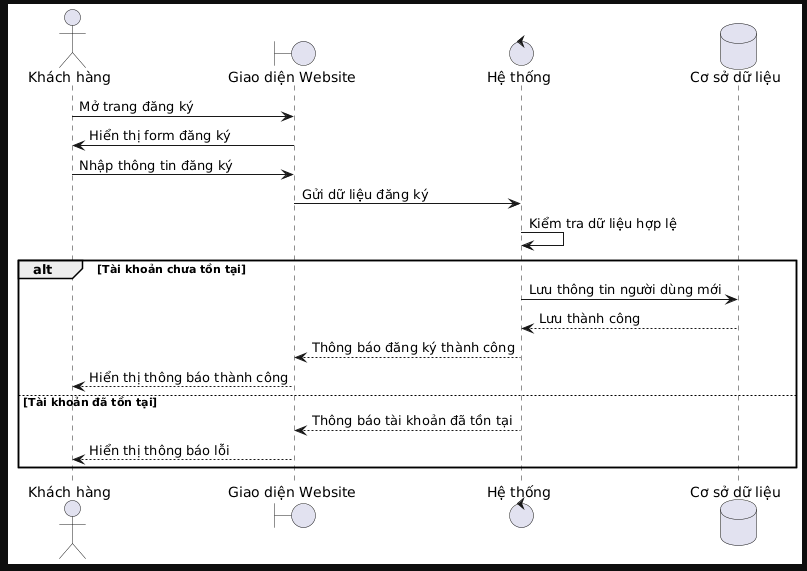

##### Đặc tả

##### Đăng ký

| Thuộc tính                 | Mô tả                                                                                                                                                                                                                                                                                          |
| ---------------------------- | ------------------------------------------------------------------------------------------------------------------------------------------------------------------------------------------------------------------------------------------------------------------------------------------------ |
| **Tên kịch bản**    | Đăng ký tài khoản                                                                                                                                                                                                                                                                           |
| **Tác nhân**         | Khách hàng                                                                                                                                                                                                                                                                                     |
| **Mô tả**            | Mô tả trình tự các bước khi khách hàng đăng ký tài khoản mới trên hệ thống                                                                                                                                                                                                     |
| **Tiền điều kiện** | Khách hàng chưa có tài khoản, hệ thống hoạt động bình thường                                                                                                                                                                                                                       |
| **Hậu điều kiện**  | Tài khoản khách hàng được tạo và lưu vào cơ sở dữ liệu                                                                                                                                                                                                                            |
| **Luồng chính**      | 1. Khách hàng truy cập trang đăng ký 2. Hệ thống hiển thị form đăng ký 3. Khách hàng nhập thông tin cá nhân 4. Gửi yêu cầu đăng ký 5. Hệ thống kiểm tra dữ liệu 6. Lưu tài khoản vào CSDL 7. Thông báo đăng ký thành công |
| **Luồng thay thế**   | - Thông tin không hợp lệ → yêu cầu nhập lại - Email đã tồn tại → thông báo lỗi                                                                                                                                                                                             |

---

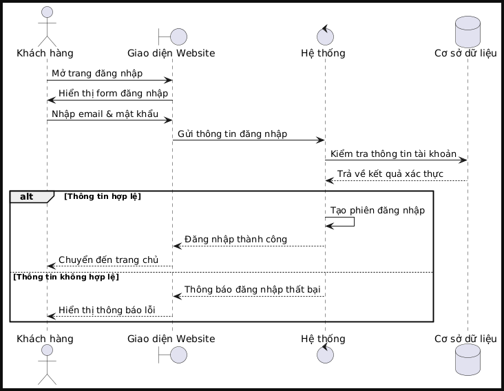

##### Đặc tả

##### Đăng nhập

---

| Thuộc tính                 | Mô tả                                                                                                                                                                                                                  |
| ---------------------------- | ------------------------------------------------------------------------------------------------------------------------------------------------------------------------------------------------------------------------ |
| **Tên kịch bản**    | Đăng nhập tài khoản                                                                                                                                                                                                 |
| **Tác nhân**         | Khách hàng                                                                                                                                                                                                             |
| **Mô tả**            | Mô tả quá trình khách hàng đăng nhập vào hệ thống                                                                                                                                                            |
| **Tiền điều kiện** | Khách hàng đã có tài khoản hợp lệ                                                                                                                                                                               |
| **Hậu điều kiện**  | Khách hàng đăng nhập thành công và có phiên làm việc                                                                                                                                                         |
| **Luồng chính**      | 1. Truy cập trang đăng nhập 2. Hiển thị form đăng nhập 3. Nhập email và mật khẩu 4. Hệ thống xác thực thông tin 5. Tạo phiên đăng nhập 6. Chuyển hướng về trang chủ |
| **Luồng thay thế**   | - Sai thông tin đăng nhập → thông báo lỗi - Tài khoản bị khóa → từ chối đăng nhập                                                                                                                 |

---                                                                                           |

#### 6. Quản lý thông tin cá nhân

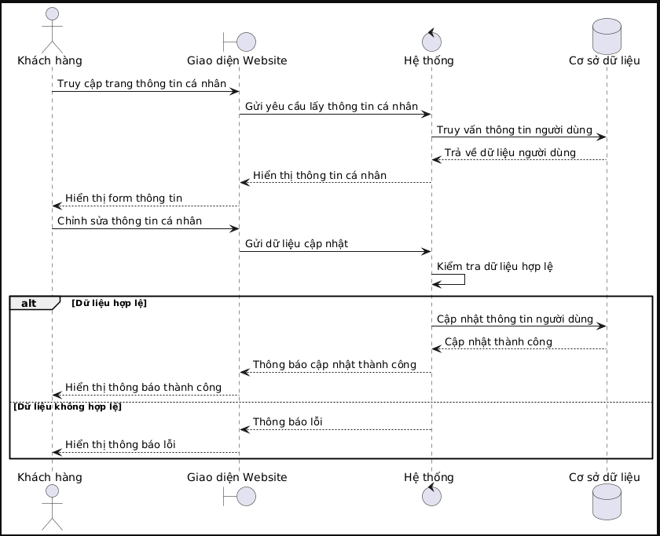

##### Đặc tả

---

## Sequence Diagram: Quản lý thông tin cá nhân

### Bảng đặc tả Sequence Diagram – Quản lý thông tin cá nhân

| Thuộc tính                 | Mô tả                                                                                                                                                                                                                                                                                                                                                                                                                                                                                                                                                                                                                                                                                                                            |
| ---------------------------- | ---------------------------------------------------------------------------------------------------------------------------------------------------------------------------------------------------------------------------------------------------------------------------------------------------------------------------------------------------------------------------------------------------------------------------------------------------------------------------------------------------------------------------------------------------------------------------------------------------------------------------------------------------------------------------------------------------------------------------------- |
| **Tên kịch bản**    | Quản lý thông tin cá nhân                                                                                                                                                                                                                                                                                                                                                                                                                                                                                                                                                                                                                                                                                                     |
| **Tác nhân chính**  | Khách hàng                                                                                                                                                                                                                                                                                                                                                                                                                                                                                                                                                                                                                                                                                                                       |
| **Tác nhân phụ**    | Hệ thống Website, Cơ sở dữ liệu                                                                                                                                                                                                                                                                                                                                                                                                                                                                                                                                                                                                                                                                                              |
| **Mô tả**            | Khách hàng xem và cập nhật thông tin cá nhân của mình như tên, số điện thoại, địa chỉ giao hàng.                                                                                                                                                                                                                                                                                                                                                                                                                                                                                                                                                                                                               |
| **Tiền điều kiện** | Khách hàng đã đăng nhập thành công vào hệ thống.                                                                                                                                                                                                                                                                                                                                                                                                                                                                                                                                                                                                                                                                       |
| **Hậu điều kiện**  | Thông tin cá nhân được cập nhật và lưu trữ chính xác trong cơ sở dữ liệu.                                                                                                                                                                                                                                                                                                                                                                                                                                                                                                                                                                                                                                         |
| **Luồng chính**      | 1. Khách hàng truy cập chức năng Quản lý thông tin cá nhân. 2. Hệ thống gửi yêu cầu lấy thông tin cá nhân của khách hàng. 3. Cơ sở dữ liệu trả về thông tin hiện tại của khách hàng. 4. Hệ thống hiển thị thông tin cá nhân lên giao diện. 5. Khách hàng chỉnh sửa thông tin (tên, số điện thoại, địa chỉ). 6. Khách hàng nhấn **Lưu cập nhật**. 7. Hệ thống kiểm tra tính hợp lệ của dữ liệu. 8. Hệ thống cập nhật thông tin mới vào cơ sở dữ liệu. 9. Cơ sở dữ liệu phản hồi cập nhật thành công. 10. Hệ thống hiển thị thông báo cập nhật thành công cho khách hàng. |
| **Luồng thay thế**   | Dữ liệu nhập không hợp lệ (thiếu thông tin, sai định dạng) → Hệ thống hiển thị thông báo lỗi và yêu cầu nhập lại. Cập nhật thất bại do lỗi hệ thống → Hệ thống hiển thị thông báo *“Cập nhật không thành công”*.                                                                                                                                                                                                                                                                                                                                                                                                                                                               |

#### 7. Xem lịch sử đơn hàng

##### Đặc tả

| Thuộc tính                 | Mô tả                                                                                                                                                                                                     |
| ---------------------------- | ----------------------------------------------------------------------------------------------------------------------------------------------------------------------------------------------------------- |
| **Tên kịch bản**    | Xem lịch sử đơn hàng                                                                                                                                                                                   |
| **Tác nhân**         | Khách hàng                                                                                                                                                                                                |
| **Mô tả**            | Mô tả trình tự các bước khi khách hàng xem các đơn hàng đã đặt                                                                                                                             |
| **Tiền điều kiện** | Khách hàng đã đăng nhập                                                                                                                                                                              |
| **Hậu điều kiện**  | Danh sách đơn hàng của khách hàng được hiển thị                                                                                                                                                 |
| **Luồng chính**      | 1. Truy cập chức năng lịch sử đơn hàng 2. Hệ thống kiểm tra đăng nhập 3. Truy vấn đơn hàng từ CSDL 4. Hiển thị danh sách đơn hàng 5. Xem chi tiết đơn hàng |
| **Luồng thay thế**   | - Chưa đăng nhập → yêu cầu đăng nhập - Không có đơn hàng → hiển thị thông báo                                                                                                      |

---

#### A) Quản trị viên

#### 8. Quản lý danh mục món ăn
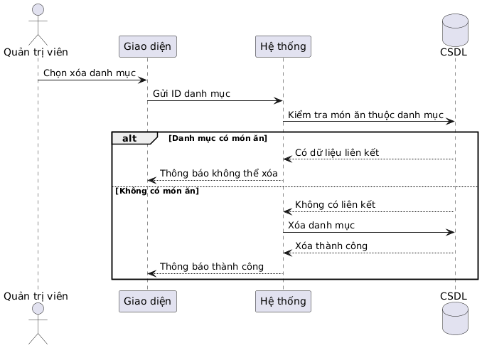
**ĐẶC TẢ SƠ ĐỒ TUẦN TỰ**
Use case: Quản lý danh mục món ăn (Xóa danh mục)
🔹 Actor
•	Quản trị viên
🔹 Các đối tượng tham gia
•	Giao diện (UI)
•	Hệ thống
•	Cơ sở dữ liệu (CSDL)
🔹 Luồng chính
1.	Quản trị viên chọn chức năng Xóa danh mục món ăn.
2.	Giao diện gửi ID danh mục cần xóa đến Hệ thống.
3.	Hệ thống kiểm tra trong CSDL xem danh mục có chứa món ăn hay không.
4.	Nếu danh mục không chứa món ăn, Hệ thống thực hiện xóa danh mục trong CSDL.
5.	CSDL xác nhận xóa thành công.
6.	Hệ thống thông báo kết quả thành công cho quản trị viên.
🔹 Luồng phụ
•	Luồng phụ 1 – Danh mục có món ăn
o	Tại bước 3, nếu danh mục còn tồn tại món ăn, Hệ thống không cho phép xóa và gửi thông báo lỗi.
🔹 Thứ tự message
1.	Admin → UI: Chọn xóa danh mục
2.	UI → System: Gửi ID danh mục
3.	System → DB: Kiểm tra ràng buộc
4.	DB → System: Kết quả kiểm tra
5.	System → DB: Xóa danh mục
6.	System → UI: Thông báo kết quả
#### 9. Quản lý tài khoản người dùng
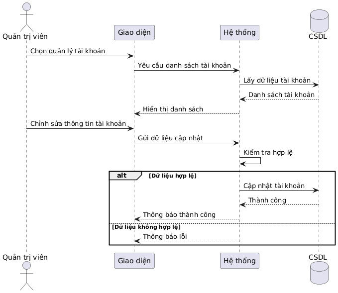
**ĐẶC TẢ SƠ ĐỒ TUẦN TỰ**
🔹 Actor
•	Quản trị viên
🔹 Các đối tượng tham gia
•	Giao diện (UI): Tiếp nhận thao tác từ quản trị viên
•	Hệ thống: Xử lý nghiệp vụ quản lý tài khoản
•	Cơ sở dữ liệu (CSDL): Lưu trữ thông tin tài khoản người dùng
🔹 Luồng chính
1.	Quản trị viên chọn chức năng Quản lý tài khoản người dùng trên giao diện.
2.	Giao diện gửi yêu cầu lấy danh sách tài khoản đến Hệ thống.
3.	Hệ thống truy vấn CSDL để lấy thông tin tài khoản.
4.	CSDL trả về danh sách tài khoản cho Hệ thống.
5.	Hệ thống hiển thị danh sách tài khoản trên giao diện.
6.	Quản trị viên chọn một tài khoản và thực hiện chỉnh sửa thông tin.
7.	Giao diện gửi dữ liệu cập nhật đến Hệ thống.
8.	Hệ thống kiểm tra tính hợp lệ của dữ liệu.
9.	Hệ thống cập nhật thông tin tài khoản vào CSDL.
10.	Hệ thống thông báo cập nhật thành công cho quản trị viên.
🔹 Luồng phụ
•	Luồng phụ 1 – Dữ liệu không hợp lệ
o	Tại bước 8, nếu dữ liệu không hợp lệ, Hệ thống không cập nhật CSDL và gửi thông báo lỗi về giao diện.
🔹 Thứ tự message
1.	Admin → UI: Chọn quản lý tài khoản
2.	UI → System: Yêu cầu danh sách tài khoản
3.	System → DB: Truy vấn tài khoản
4.	DB → System: Trả về danh sách
5.	System → UI: Hiển thị danh sách
6.	Admin → UI: Chỉnh sửa tài khoản
7.	UI → System: Gửi dữ liệu cập nhật
8.	System → DB: Cập nhật tài khoản
9.	System → UI: Thông báo kết quả
#### 10. Quản lý đơn hàng

**ĐẶC TẢ SƠ ĐỒ TUẦN TỰ**
🔹 Actor
•	Quản trị viên
🔹 Các đối tượng tham gia
•	Giao diện (UI)
•	Hệ thống
•	Cơ sở dữ liệu (CSDL)
🔹 Luồng chính
1.	Quản trị viên chọn chức năng Cập nhật trạng thái đơn hàng.
2.	Giao diện gửi trạng thái mới của đơn hàng đến Hệ thống.
3.	Hệ thống kiểm tra trạng thái đơn hàng có hợp lệ hay không.
4.	Hệ thống cập nhật trạng thái đơn hàng trong CSDL.
5.	CSDL xác nhận cập nhật thành công.
6.	Hệ thống thông báo kết quả cho quản trị viên.
🔹 Luồng phụ
•	Luồng phụ 1 – Trạng thái không hợp lệ
o	Tại bước 3, nếu trạng thái không hợp lệ, Hệ thống không cập nhật CSDL và hiển thị thông báo lỗi.
🔹 Thứ tự message
1.	Admin → UI: Chọn cập nhật trạng thái
2.	UI → System: Gửi trạng thái mới
3.	System → DB: Cập nhật trạng thái
4.	DB → System: Xác nhận
5.	System → UI: Thông báo kết quả
#### 11. Quản lý món ăn
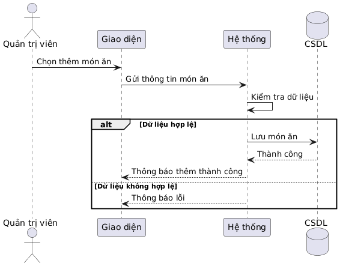
🔹 Actor
•	Quản trị viên
🔹 Các đối tượng tham gia
•	Giao diện (UI)
•	Hệ thống
•	Cơ sở dữ liệu (CSDL)
🔹 Luồng chính
1.	Quản trị viên chọn chức năng Thêm món ăn.
2.	Giao diện hiển thị form nhập thông tin món ăn.
3.	Quản trị viên nhập thông tin và gửi yêu cầu thêm món ăn.
4.	Hệ thống kiểm tra tính hợp lệ của dữ liệu món ăn.
5.	Hệ thống lưu thông tin món ăn vào CSDL.
6.	CSDL xác nhận lưu thành công.
7.	Hệ thống thông báo kết quả cho quản trị viên.
🔹 Luồng phụ
•	Luồng phụ 1 – Dữ liệu không hợp lệ
o	Tại bước 4, nếu dữ liệu không hợp lệ, Hệ thống không lưu CSDL và hiển thị thông báo lỗi.
🔹 Thứ tự message
1.	Admin → UI: Chọn thêm món ăn
2.	UI → System: Gửi thông tin món ăn
3.	System → System: Kiểm tra dữ liệu
4.	System → DB: Lưu món ăn
5.	DB → System: Xác nhận
6.	System → UI: Thông báo kết quả
#### 12. Quản lý thanh toán

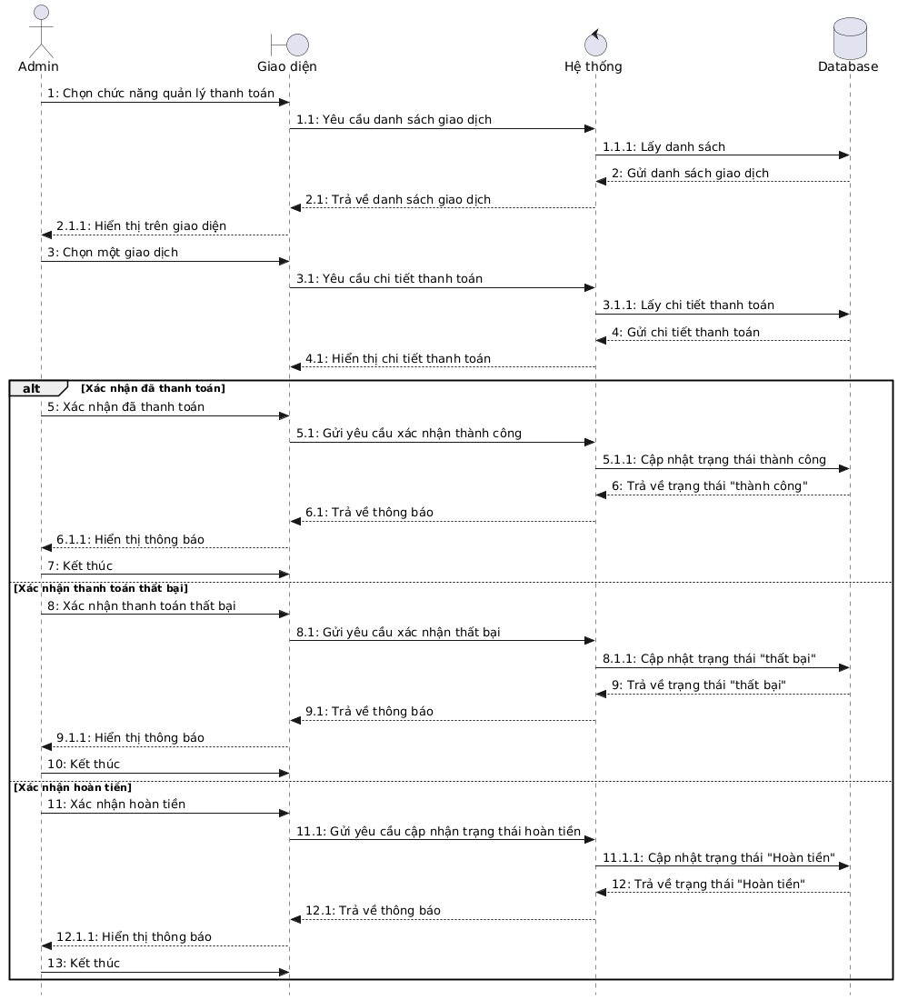
**Mô tả:**  
Cho phép Admin xem danh sách giao dịch, xác nhận trạng thái thanh toán và thực hiện hoàn tiền.

**Tiền điều kiện:**  
Admin đã đăng nhập hệ thống và có quyền quản lý thanh toán.

**Hậu điều kiện:**  
Trạng thái giao dịch được cập nhật (thành công/thất bại/hoàn tiền) hoặc hệ thống thông báo lỗi.

| From | To | Message |
|------|----|---------|
| Admin | UI | Chọn chức năng quản lý thanh toán |
| UI | System | Yêu cầu danh sách giao dịch |
| System | DB | Lấy danh sách giao dịch |
| DB | System | Trả danh sách giao dịch |
| System | UI | Hiển thị danh sách giao dịch |
| Admin | UI | Chọn một giao dịch |
| UI | System | Yêu cầu chi tiết giao dịch |
| System | DB | Lấy chi tiết giao dịch |
| DB | System | Trả chi tiết giao dịch |
| Admin | UI | Xác nhận thanh toán / thất bại / hoàn tiền |
| UI | System | Gửi yêu cầu cập nhật trạng thái |
| System | DB | Cập nhật trạng thái giao dịch |
| DB | System | Trả kết quả cập nhật |
| System | UI | Trả thông báo |
| UI | Admin | Hiển thị kết quả |
#### 13. Thống kê & báo cáo

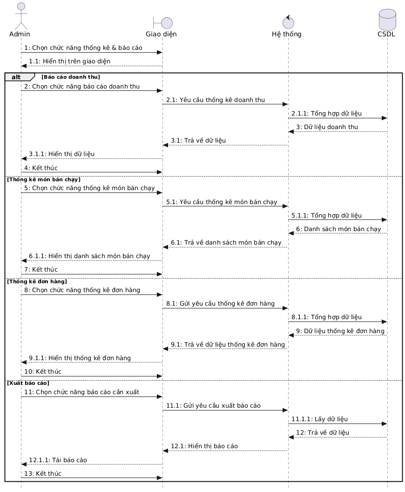
**Mô tả:**  
Cho phép Admin xem thống kê doanh thu, đơn hàng, món bán chạy và xuất báo cáo.

**Tiền điều kiện:**  
Admin đã đăng nhập và hệ thống có dữ liệu giao dịch.

**Hậu điều kiện:**  
Báo cáo được hiển thị hoặc xuất file theo yêu cầu.

| From | To | Message |
|------|----|---------|
| Admin | UI | Chọn chức năng thống kê & báo cáo |
| UI | Admin | Hiển thị các loại báo cáo |
| Admin | UI | Chọn loại báo cáo |
| UI | System | Gửi yêu cầu thống kê |
| System | System | Kiểm tra tiêu chí |
| System | DB | Tổng hợp dữ liệu thống kê |
| DB | System | Trả dữ liệu |
| System | UI | Trả kết quả thống kê |
| UI | Admin | Hiển thị báo cáo |
| Admin | UI | Xuất báo cáo hoặc kết thúc |
#### 14. Quản lý nội dung website

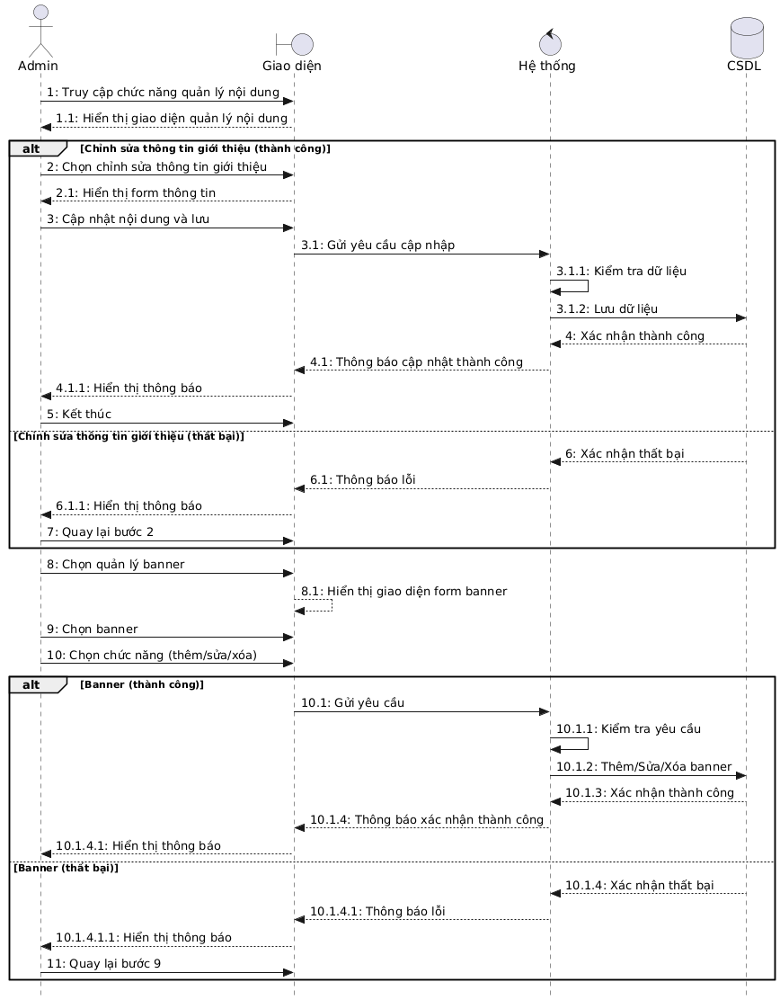
**Mô tả:**  
Cho phép Admin cập nhật thông tin website và quản lý banner.

**Tiền điều kiện:**  
Admin đã đăng nhập và có quyền quản lý nội dung.

**Hậu điều kiện:**  
Nội dung hoặc banner được cập nhật thành công hoặc hiển thị thông báo lỗi.

| From | To | Message |
|------|----|---------|
| Admin | UI | Chọn chức năng quản lý nội dung |
| UI | Admin | Hiển thị giao diện quản lý nội dung |
| Admin | UI | Chỉnh sửa thông tin / banner |
| UI | System | Gửi yêu cầu cập nhật |
| System | System | Kiểm tra dữ liệu |
| System | DB | Lưu dữ liệu nội dung |
| DB | System | Trả kết quả |
| System | UI | Trả thông báo |
| UI | Admin | Hiển thị kết quả |
| Admin | UI | Kết thúc |
---

## 5. Thiết Kế Phần Mềm

## 5.1 Thiết kế chức năng phía người dùng

### 5.1.1. Quản lý tài khoản người dùng

#### 1. Đăng ký tài khoản

**Mô tả:** Người dùng có thể đăng ký tài khoản mới để sử dụng hệ thống.

**Chức năng:**

- Form đăng ký với các trường: Họ tên, Email (chỉ chấp nhận Gmail), Mật khẩu, Xác nhận mật khẩu, Số điện thoại, Địa chỉ
- Validation dữ liệu đầu vào:
  - Email phải là định dạng Gmail (@gmail.com)
  - Mật khẩu tối thiểu 6 ký tự
  - Mật khẩu và xác nhận mật khẩu phải khớp
- Xác minh email qua mã 6 số:
  - Tạo mã xác minh ngẫu nhiên 6 chữ số
  - Gửi mã qua email sử dụng PHPMailer (Gmail SMTP)
  - Mã có thời hạn 10 phút
  - Lưu mã vào database với trạng thái chưa xác minh
- Hash mật khẩu bằng `password_hash()` trước khi lưu vào database
- Kiểm tra email đã tồn tại trong hệ thống

**Luồng xử lý:**

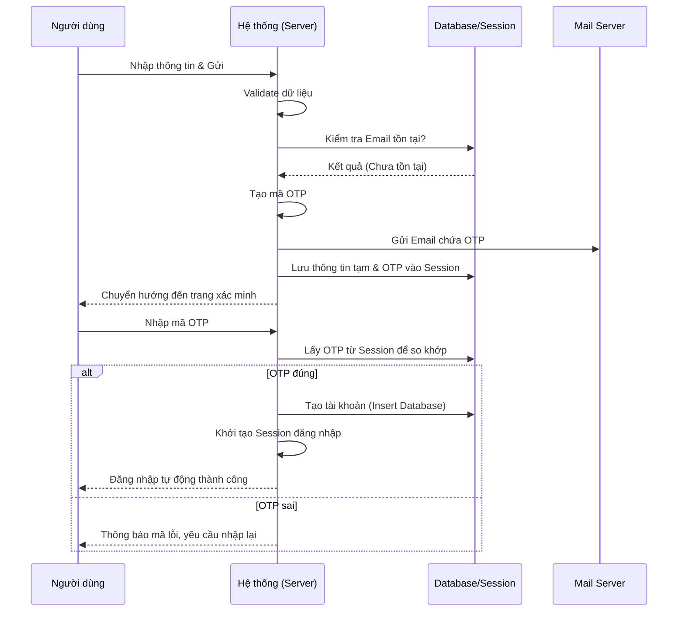
```mermaid
sequenceDiagram
    participant U as Người dùng
    participant S as Hệ thống (Server)
    participant DB as Database/Session
    participant M as Mail Server

    U->>S: Nhập thông tin & Gửi
    S->>S: Validate dữ liệu
    S->>DB: Kiểm tra Email tồn tại?
    DB-->>S: Kết quả (Chưa tồn tại)
  
    S->>S: Tạo mã OTP
    S->>M: Gửi Email chứa OTP
    S->>DB: Lưu thông tin tạm & OTP vào Session
    S-->>U: Chuyển hướng đến trang xác minh
  
    U->>S: Nhập mã OTP
    S->>DB: Lấy OTP từ Session để so khớp
  
    alt OTP đúng
        S->>DB: Tạo tài khoản (Insert Database)
        S->>S: Khởi tạo Session đăng nhập
        S-->>U: Đăng nhập tự động thành công
    else OTP sai
        S-->>U: Thông báo mã lỗi, yêu cầu nhập lại
    end
```

#### 2. Đăng nhập

**Mô tả:** Người dùng đăng nhập vào hệ thống bằng email và mật khẩu.

**Chức năng:**

- Form đăng nhập với Email và Mật khẩu
- Xác thực thông tin đăng nhập:
  - Kiểm tra email tồn tại trong database
  - Kiểm tra tài khoản có trạng thái Active
  - Xác thực mật khẩu bằng `password_verify()`
- Lưu thông tin user vào session:
  - `user_id` - ID người dùng
  - `user` - Tên đăng nhập
  - `user_full_name` - Họ tên đầy đủ
- Redirect thông minh:
  - Nếu có `redirect_food_id` trong session → chuyển đến trang đặt hàng
  - Ngược lại → chuyển về trang chủ
- Hiển thị thông báo lỗi nếu đăng nhập thất bại

#### 3. Quên mật khẩu

**Mô tả:** Người dùng có thể khôi phục mật khẩu nếu quên.

**Chức năng:**

- Form nhập email để yêu cầu đặt lại mật khẩu
- Gửi mã xác minh 6 số qua email
- Giới hạn số lần thử nhập mã (5 lần)
- Mã xác minh có thời hạn 10 phút
- Form đặt lại mật khẩu mới sau khi xác minh thành công
- Hash mật khẩu mới trước khi cập nhật

**Luồng xử lý:**

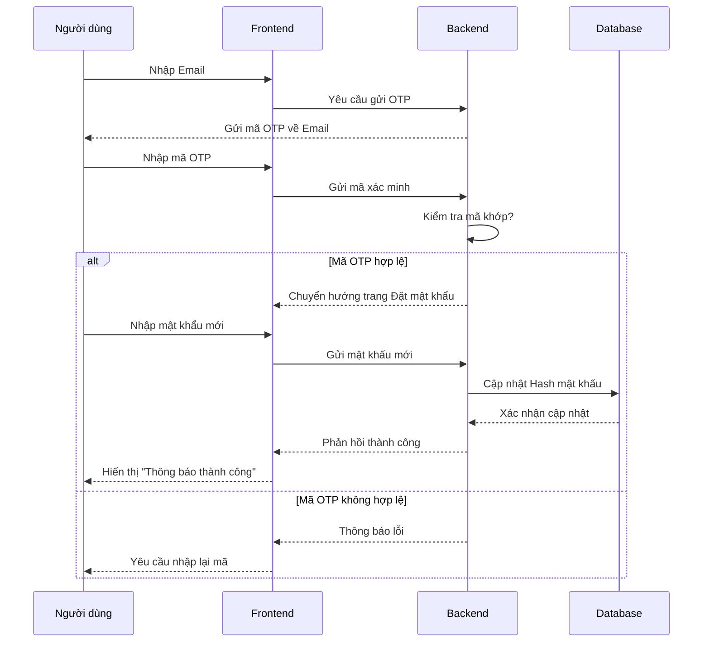
```mermaid
sequenceDiagram
    participant U as Người dùng
    participant FE as Frontend
    participant BE as Backend
    participant DB as Database

    U->>FE: Nhập Email
    FE->>BE: Yêu cầu gửi OTP
    BE-->>U: Gửi mã OTP về Email
  
    U->>FE: Nhập mã OTP
    FE->>BE: Gửi mã xác minh
    BE->>BE: Kiểm tra mã khớp?
  
    alt Mã OTP hợp lệ
        BE-->>FE: Chuyển hướng trang Đặt mật khẩu
        U->>FE: Nhập mật khẩu mới
        FE->>BE: Gửi mật khẩu mới
        BE->>DB: Cập nhật Hash mật khẩu
        DB-->>BE: Xác nhận cập nhật
        BE-->>FE: Phản hồi thành công
        FE-->>U: Hiển thị "Thông báo thành công"
    else Mã OTP không hợp lệ
        BE-->>FE: Thông báo lỗi
        FE-->>U: Yêu cầu nhập lại mã
    end
```

#### 4. Đăng xuất

**Mô tả:** Người dùng có thể đăng xuất khỏi hệ thống.

**Chức năng:**

- Xóa tất cả session của người dùng
- Chuyển hướng về trang chủ
- Hiển thị thông báo đăng xuất thành công

---

### 5.1.2. Duyệt và tìm kiếm món ăn

#### 1. Trang chủ

**Mô tả:** Hiển thị thông tin tổng quan về hệ thống và món ăn nổi bật.

**Chức năng:**

- Hiển thị form tìm kiếm món ăn
- Hiển thị 3 danh mục đầu tiên với hình ảnh
- Hiển thị 6 món ăn đầu tiên trong menu
- Mỗi món ăn hiển thị: Tên, Giá, Mô tả, Hình ảnh
- Nút "Thêm vào giỏ" nếu đã đăng nhập, "Đặt ngay" nếu chưa đăng nhập
- Link "Xem tất cả món ăn" để xem toàn bộ menu

#### 2. Xem danh sách món ăn

**Mô tả:** Hiển thị toàn bộ món ăn trong hệ thống.

**Chức năng:**

- Hiển thị tất cả món ăn có trong database
- Mỗi món ăn hiển thị đầy đủ thông tin: Tên, Giá, Mô tả, Hình ảnh
- Nút thêm vào giỏ hàng (yêu cầu đăng nhập)
- Responsive design cho mobile

#### 3. Xem món ăn theo danh mục

**Mô tả:** Lọc và hiển thị món ăn theo từng danh mục.

**Chức năng:**

- Hiển thị danh sách tất cả danh mục
- Khi click vào danh mục, hiển thị các món ăn thuộc danh mục đó
- Hiển thị thông báo nếu danh mục chưa có món ăn

#### 4. Tìm kiếm món ăn

**Mô tả:** Tìm kiếm món ăn theo từ khóa.

**Chức năng:**

- Form tìm kiếm với ô nhập từ khóa
- Tìm kiếm trong tên món ăn (`title`) và mô tả (`description`)
- Hiển thị kết quả tìm kiếm với đầy đủ thông tin món ăn
- Hiển thị thông báo nếu không tìm thấy kết quả

**Luồng xử lý:**

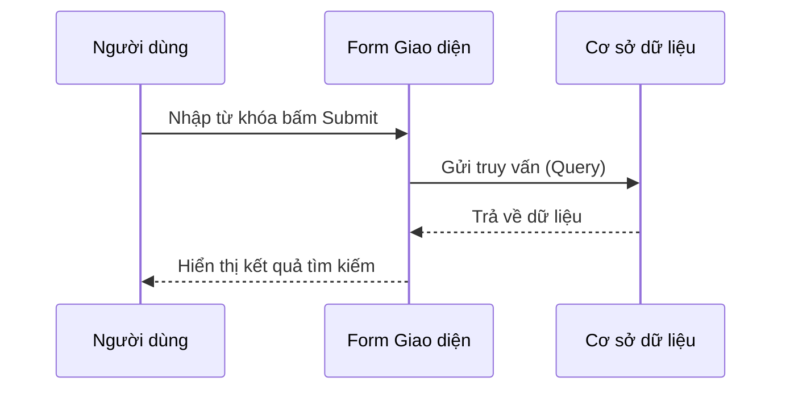
```mermaid
sequenceDiagram
    participant U as Người dùng
    participant F as Form Giao diện
    participant DB as Cơ sở dữ liệu

    U->>F: Nhập từ khóa bấm Submit
    F->>DB: Gửi truy vấn (Query)
    DB-->>F: Trả về dữ liệu
    F-->>U: Hiển thị kết quả tìm kiếm
```

---

### 5.1.3. Quản lý giỏ hàng

#### 1. Thêm món vào giỏ hàng

**Mô tả:** Người dùng có thể thêm món ăn vào giỏ hàng.

**Chức năng:**

- Nút "Thêm vào giỏ" trên mỗi món ăn
- Yêu cầu đăng nhập trước khi thêm vào giỏ
- Thêm món vào giỏ hàng qua AJAX (không reload trang)
- Hiển thị thông báo thành công khi thêm vào giỏ
- Cập nhật số lượng món trong giỏ hàng (badge)
- Nếu món đã có trong giỏ, tăng số lượng thay vì tạo mới

#### 2. Xem giỏ hàng

**Mô tả:** Hiển thị danh sách món ăn trong giỏ hàng.

**Chức năng:**

- Hiển thị danh sách món ăn trong giỏ hàng:
  - Hình ảnh món ăn
  - Tên món ăn
  - Giá đơn vị
  - Số lượng (có thể tăng/giảm)
  - Ghi chú cho món ăn (VD: ăn cay, không cay, nhiều, ít...)
  - Tổng tiền cho mỗi món
- Tính tổng tiền toàn bộ giỏ hàng
- Nút tăng/giảm số lượng
- Nút xóa món khỏi giỏ hàng
- Ô nhập ghi chú cho từng món
- Nút "Thanh toán" để chuyển đến trang checkout
- Hiển thị thông báo nếu giỏ hàng trống

**Luồng xử lý:**

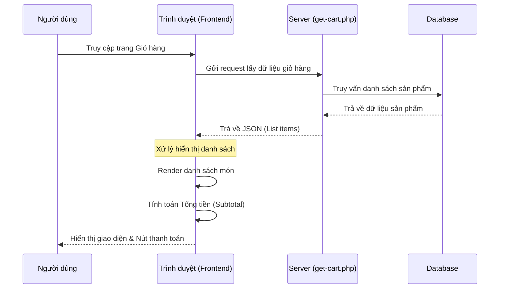
```mermaid
sequenceDiagram
    participant U as Người dùng
    participant B as Trình duyệt (Frontend)
    participant S as Server (get-cart.php)
    participant DB as Database

    U->>B: Truy cập trang Giỏ hàng
    B->>S: Gửi request lấy dữ liệu giỏ hàng
    S->>DB: Truy vấn danh sách sản phẩm
    DB-->>S: Trả về dữ liệu sản phẩm
    S-->>B: Trả về JSON (List items)
  
    Note over B: Xử lý hiển thị danh sách
    B->>B: Render danh sách món
    B->>B: Tính toán Tổng tiền (Subtotal)
  
    B-->>U: Hiển thị giao diện & Nút thanh toán

```

---

### 5.1.4. Đặt hàng và thanh toán

#### 1. Thanh toán (Checkout)

**Mô tả:** Người dùng điền thông tin giao hàng và xác nhận đặt hàng.

**Chức năng:**

- Form nhập thông tin giao hàng:
  - Họ tên người nhận (tự động điền từ thông tin user)
  - Số điện thoại (tự động điền)
  - Email (tự động điền)
  - Địa chỉ giao hàng (tự động điền)
- Hiển thị tóm tắt đơn hàng:
  - Danh sách món ăn, số lượng, ghi chú
  - Tổng tiền đơn hàng
- Chọn phương thức thanh toán:
  - Tiền mặt (COD)
  - Thanh toán online
- Tạo mã đơn hàng duy nhất:
  - Format: `ORD` + `YYYYMMDD` + `6 ký tự ngẫu nhiên`
  - Ví dụ: `ORD20241215ABC123`
- Xử lý đặt hàng:
  - Tạo đơn hàng cho từng món trong giỏ
  - Lưu thông tin đơn hàng vào database
  - Xóa giỏ hàng sau khi đặt hàng thành công
  - Nếu thanh toán online → chuyển đến trang payment
  - Nếu thanh toán tiền mặt → chuyển đến trang lịch sử đơn hàng

**Luồng xử lý:**

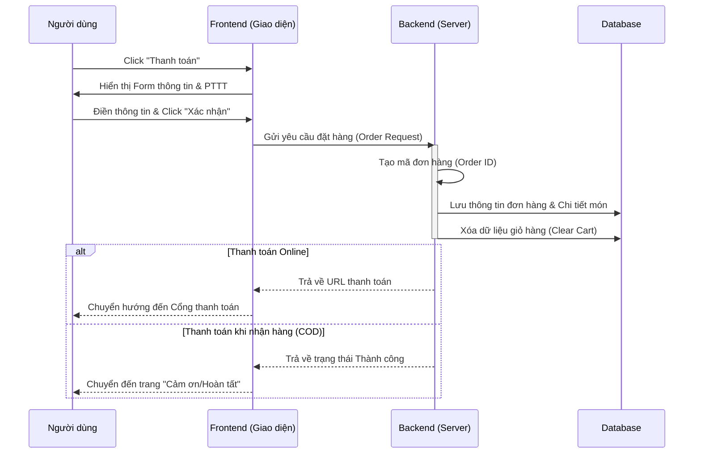
```mermaid
sequenceDiagram
    participant U as Người dùng
    participant FE as Frontend (Giao diện)
    participant BE as Backend (Server)
    participant DB as Database

    U->>FE: Click "Thanh toán"
    FE->>U: Hiển thị Form thông tin & PTTT
    U->>FE: Điền thông tin & Click "Xác nhận"
  
    FE->>BE: Gửi yêu cầu đặt hàng (Order Request)
  
    activate BE
    BE->>BE: Tạo mã đơn hàng (Order ID)
    BE->>DB: Lưu thông tin đơn hàng & Chi tiết món
    BE->>DB: Xóa dữ liệu giỏ hàng (Clear Cart)
    deactivate BE
  
    alt Thanh toán Online
        BE-->>FE: Trả về URL thanh toán
        FE-->>U: Chuyển hướng đến Cổng thanh toán
    else Thanh toán khi nhận hàng (COD)
        BE-->>FE: Trả về trạng thái Thành công
        FE-->>U: Chuyển đến trang "Cảm ơn/Hoàn tất"
    end

```

#### 2. Lịch sử đặt hàng

**Mô tả:** Người dùng xem lịch sử các đơn hàng đã đặt.

**Chức năng:**

- Hiển thị danh sách đơn hàng của user:
  - Mã đơn hàng (có nút copy)
  - Ngày đặt hàng
  - Trạng thái đơn hàng (màu sắc khác nhau):
    - Đã đặt hàng (Ordered) - màu vàng
    - Đang giao hàng (On Delivery) - màu cam
    - Đã giao hàng (Delivered) - màu xanh lá
    - Đã hủy (Cancelled) - màu đỏ
  - Thông tin món ăn: Tên, Số lượng, Đơn giá, Tổng tiền
  - Thông tin giao hàng: Tên người nhận, Địa chỉ
- Nút "Chat hỗ trợ đơn này" để liên hệ admin về đơn hàng cụ thể
- Hiển thị thông báo nếu chưa có đơn hàng nào

---

### 5.1.5. Hệ thống chat với Admin

#### 1. Chat với Admin

**Mô tả:** Người dùng có thể chat với admin để được hỗ trợ.

**Chức năng:**

- Giao diện chat real-time:
  - Hiển thị tin nhắn đã gửi/nhận
  - Phân biệt tin nhắn của user và admin (màu sắc khác nhau)
  - Hiển thị thời gian gửi tin nhắn
  - Tự động scroll xuống tin nhắn mới nhất
- Gửi tin nhắn:
  - Form nhập tin nhắn
  - Gửi tin nhắn qua AJAX (không reload trang)
  - Hiển thị tin nhắn ngay sau khi gửi
- Nhận tin nhắn:
  - Polling mỗi 2 giây để lấy tin nhắn mới
  - Tự động hiển thị tin nhắn mới từ admin
  - Đánh dấu tin nhắn đã đọc khi mở trang chat
- Chat về đơn hàng cụ thể:
  - Có thể truyền `order_code` qua URL
  - Hiển thị thông báo về đơn hàng đang chat
  - Nút chèn mã đơn hàng vào tin nhắn
- Badge thông báo số tin nhắn chưa đọc (trong menu)

**Luồng xử lý:**

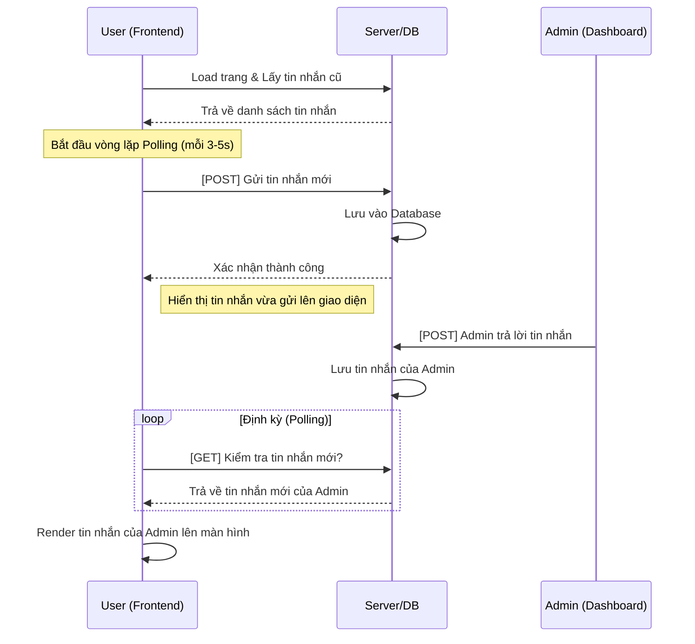
```mermaid
sequenceDiagram
    participant U as User (Frontend)
    participant S as Server/DB
    participant A as Admin (Dashboard)

    U->>S: Load trang & Lấy tin nhắn cũ
    S-->>U: Trả về danh sách tin nhắn
  
    Note over U: Bắt đầu vòng lặp Polling (mỗi 3-5s)
  
    U->>S: [POST] Gửi tin nhắn mới
    S->>S: Lưu vào Database
    S-->>U: Xác nhận thành công
    Note right of U: Hiển thị tin nhắn vừa gửi lên giao diện
  
    A->>S: [POST] Admin trả lời tin nhắn
    S->>S: Lưu tin nhắn của Admin
  
    loop Định kỳ (Polling)
        U->>S: [GET] Kiểm tra tin nhắn mới?
        S-->>U: Trả về tin nhắn mới của Admin
    end
  
    U->>U: Render tin nhắn của Admin lên màn hình

```

### 5.1.6 Trang Thanh Toán

**Mục đích:** Cho phép người dùng thanh toán đơn hàng online với nhiều phương thức thanh toán.

**Các chức năng chính:**

1. **Hiển thị thông tin đơn hàng**

   - Hiển thị mã đơn hàng (`order_code`)
   - Hiển thị tổng tiền cần thanh toán
   - Kiểm tra và hiển thị trạng thái thanh toán hiện tại
2. **Chọn phương thức thanh toán**

   - **MoMo**: Ví điện tử MoMo (mặc định)
   - **Bank**: Chuyển khoản ngân hàng
   - Giao diện radio buttons với icons trực quan
3. **Countdown Timer**

   - Hiển thị thời gian còn lại (15 phút)
   - Tự động disable nút thanh toán khi hết hạn
   - Cảnh báo khi phiên thanh toán sắp hết hạn
4. **Xử lý thanh toán**

   - Validate form trước khi submit
   - Tạo/update payment record
   - Xử lý thanh toán (hiện tại mô phỏng)
   - Redirect đến lịch sử đơn hàng sau khi thành công

**Luồng xử lý:**

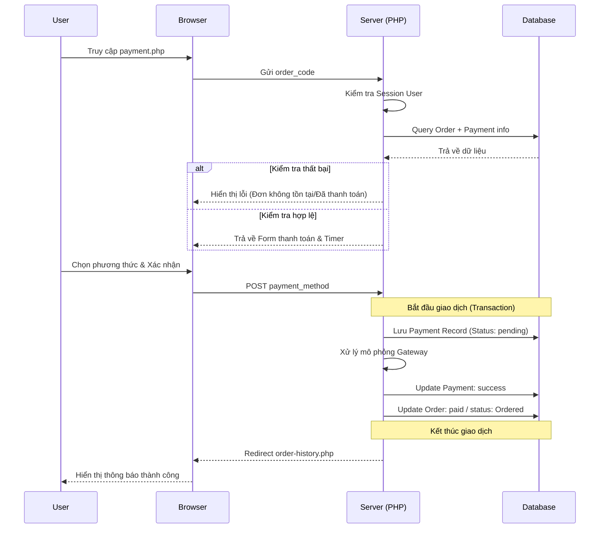
```mermaid
sequenceDiagram
    participant U as User
    participant B as Browser
    participant S as Server (PHP)
    participant DB as Database

    U->>B: Truy cập payment.php
    B->>S: Gửi order_code
    S->>S: Kiểm tra Session User
    S->>DB: Query Order + Payment info
    DB-->>S: Trả về dữ liệu
  
    alt Kiểm tra thất bại
        S-->>B: Hiển thị lỗi (Đơn không tồn tại/Đã thanh toán)
    else Kiểm tra hợp lệ
        S-->>B: Trả về Form thanh toán & Timer
    end
  
    U->>B: Chọn phương thức & Xác nhận
    B->>S: POST payment_method
  
    Note over S,DB: Bắt đầu giao dịch (Transaction)
    S->>DB: Lưu Payment Record (Status: pending)
    S->>S: Xử lý mô phỏng Gateway
    S->>DB: Update Payment: success
    S->>DB: Update Order: paid / status: Ordered
    Note over S,DB: Kết thúc giao dịch
  
    S-->>B: Redirect order-history.php
    B-->>U: Hiển thị thông báo thành công

```

**Tính năng bảo mật:**

- Session validation - chỉ user sở hữu đơn hàng mới thanh toán được
- Prepared statements - ngăn chặn SQL injection
- Input validation - kiểm tra dữ liệu đầu vào
- Double submission prevention - disable button sau khi submit
- Output buffering - tránh lỗi header khi redirect

**Tính năng UX:**

- Real-time countdown timer
- Visual feedback khi submit (button disabled, text "Đang xử lý...")
- Error messages rõ ràng
- Responsive design

#### 1.1.2. Xử Lý Lỗi và Edge Cases

1. **Đơn hàng không tồn tại**

   - Redirect đến order-history với thông báo lỗi
2. **Đơn hàng đã thanh toán**

   - Hiển thị thông báo và redirect
3. **Phiên thanh toán hết hạn**

   - Tự động set status = 'cancelled'
   - Hiển thị warning và cho phép tạo lại
4. **Payment record đã tồn tại nhưng chưa hết hạn**

   - Hiển thị thông tin payment hiện tại
   - Cho phép tiếp tục thanh toán

---

## 5.2 Thiết kế chức năng phía quản trị viên

### 5.2.1 Thiết kế chức năng phía quản trị viên

### 1. Quản lý tài khoản Admin

#### 1.1 Đăng nhập Admin

  **Mô tả:** Admin đăng nhập vào hệ thống quản trị.

  **Chức năng:**

- Form đăng nhập với Username và Password
- Xác thực thông tin đăng nhập
- Lưu thông tin admin vào session
- Phân quyền: Chỉ admin mới truy cập được admin panel
- Redirect về trang chủ nếu đăng nhập thất bại

#### 1.2 Quản lý Admin

  **Mô tả:** Quản lý danh sách quản trị viên trong hệ thống.

  **Chức năng:**

- Xem danh sách tất cả admin:
  - STT
  - Họ tên
  - Tên đăng nhập
- Thêm admin mới:
  - Form nhập thông tin: Họ tên, Username, Password
  - Hash mật khẩu trước khi lưu
- Cập nhật thông tin admin:
  - Form sửa thông tin admin
  - Có thể đổi mật khẩu
- Xóa admin:
  - Xác nhận trước khi xóa
  - Không cho phép xóa chính mình

---

### 2. Bảng điều khiển (Dashboard)

#### 2.1 Dashboard tổng quan

  **Mô tả:** Hiển thị thông tin tổng quan về hệ thống.

  **Chức năng:**

- Thống kê số liệu:

  - Tổng số danh mục
  - Tổng số món ăn
  - Tổng số đơn hàng
  - Tổng doanh thu (từ các đơn đã giao hàng)
- Biểu đồ thống kê:

  - Biểu đồ cột: So sánh số lượng danh mục, món ăn, đơn hàng
  - Biểu đồ đường: Doanh thu theo thời gian (7 ngày gần nhất)
- Hiển thị thông báo khi đăng nhập thành công

  **Sơ đồ Dashboard:**

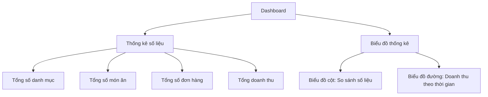
```mermaid
  graph TD
      A[Dashboard] --> B[Thống kê số liệu]
      A --> C[Biểu đồ thống kê]
  
      B --> B1[Tổng số danh mục]
      B --> B2[Tổng số món ăn]
      B --> B3[Tổng số đơn hàng]
      B --> B4[Tổng doanh thu]
  
      C --> C1[Biểu đồ cột: So sánh số liệu]
      C --> C2[Biểu đồ đường: Doanh thu theo thời gian]
```

---

### 3. Quản lý danh mục món ăn

#### 3.1 Xem danh sách danh mục

  **Mô tả:** Hiển thị danh sách tất cả danh mục món ăn.

  **Chức năng:**

- Hiển thị bảng danh sách danh mục:
  - STT
  - Tên danh mục
  - Hình ảnh (thumbnail)
  - Trạng thái nổi bật (Featured)
  - Trạng thái hoạt động (Active)
- Nút "Thêm danh mục" để tạo mới

#### 3.2 Thêm danh mục

  **Mô tả:** Tạo danh mục món ăn mới.

  **Chức năng:**

- Form nhập thông tin:

  - Tên danh mục (bắt buộc)
  - Upload hình ảnh danh mục
  - Chọn trạng thái nổi bật (Yes/No)
  - Chọn trạng thái hoạt động (Yes/No)
- Validation:

  - Tên danh mục không được trống
  - Hình ảnh phải là file ảnh hợp lệ
- Xử lý upload hình ảnh:

  - Lưu vào thư mục `image/category/`
  - Đặt tên file tự động hoặc giữ nguyên tên
- Lưu thông tin vào database
- Hiển thị thông báo thành công/thất bại

  **Luồng xử lý:**

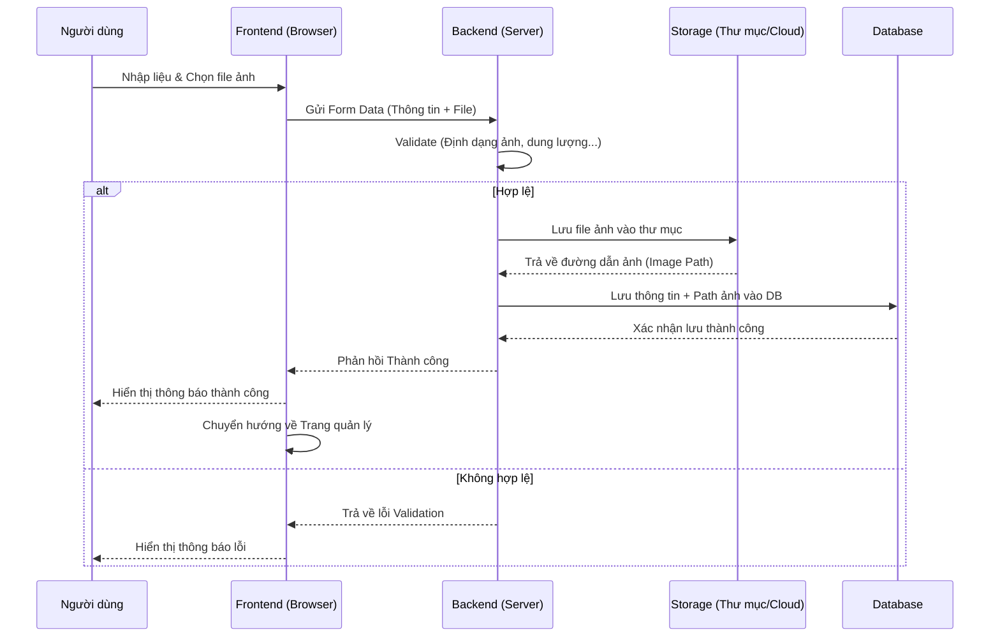
```mermaid
sequenceDiagram
    participant U as Người dùng
    participant FE as Frontend (Browser)
    participant BE as Backend (Server)
    participant ST as Storage (Thư mục/Cloud)
    participant DB as Database

    U->>FE: Nhập liệu & Chọn file ảnh
    FE->>BE: Gửi Form Data (Thông tin + File)
  
    BE->>BE: Validate (Định dạng ảnh, dung lượng...)
  
    alt Hợp lệ
        BE->>ST: Lưu file ảnh vào thư mục
        ST-->>BE: Trả về đường dẫn ảnh (Image Path)
  
        BE->>DB: Lưu thông tin + Path ảnh vào DB
        DB-->>BE: Xác nhận lưu thành công
  
        BE-->>FE: Phản hồi Thành công
        FE-->>U: Hiển thị thông báo thành công
        FE->>FE: Chuyển hướng về Trang quản lý
    else Không hợp lệ
        BE-->>FE: Trả về lỗi Validation
        FE-->>U: Hiển thị thông báo lỗi
    end
  
```

#### 3.3 Cập nhật danh mục

  **Mô tả:** Sửa thông tin danh mục món ăn.

  **Chức năng:**

- Form sửa thông tin (tương tự form thêm)
- Hiển thị thông tin hiện tại của danh mục
- Cho phép thay đổi:
  - Tên danh mục
  - Hình ảnh (có thể giữ nguyên hoặc upload mới)
  - Trạng thái nổi bật
  - Trạng thái hoạt động
- Xóa hình ảnh cũ nếu upload hình ảnh mới
- Cập nhật thông tin vào database

#### 3.4 Xóa danh mục

  **Mô tả:** Xóa danh mục món ăn khỏi hệ thống.

  **Chức năng:**

- Xác nhận trước khi xóa
- Xóa hình ảnh danh mục khỏi server
- Xóa bản ghi trong database
- Hiển thị thông báo thành công/thất bại
- Lưu ý: Cần xử lý các món ăn thuộc danh mục này (chuyển sang danh mục khác hoặc xóa luôn)

---

### 4. Quản lý món ăn

#### 4.1 Xem danh sách món ăn

  **Mô tả:** Hiển thị danh sách tất cả món ăn trong hệ thống.

  **Chức năng:**

- Hiển thị bảng danh sách món ăn:
  - STT
  - Tên món ăn
  - Giá
  - Hình ảnh (thumbnail)
  - Trạng thái nổi bật (Featured)
  - Trạng thái hoạt động (Active)
- Nút "Thêm món ăn" để tạo mới
- Nút "Cập nhật" và "Xóa" cho mỗi món ăn

#### 4.2 Thêm món ăn

  **Mô tả:** Tạo món ăn mới trong hệ thống.

  **Chức năng:**

- Form nhập thông tin:

  - Tên món ăn (bắt buộc)
  - Mô tả món ăn
  - Giá (bắt buộc, phải là số)
  - Chọn danh mục (dropdown từ danh sách danh mục)
  - Upload hình ảnh món ăn
  - Chọn trạng thái nổi bật (Yes/No)
  - Chọn trạng thái hoạt động (Yes/No)
- Validation:

  - Tên món ăn không được trống
  - Giá phải là số dương
  - Phải chọn danh mục
  - Hình ảnh phải là file ảnh hợp lệ
- Xử lý upload hình ảnh:

  - Lưu vào thư mục `image/food/`
  - Đặt tên file tự động
- Lưu thông tin vào database
- Hiển thị thông báo thành công/thất bại

  **Luồng xử lý:**

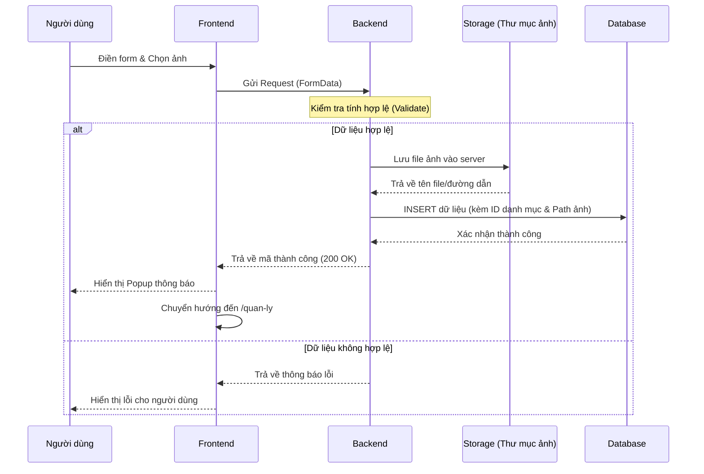
```mermaid
sequenceDiagram
    participant U as Người dùng
    participant FE as Frontend
    participant BE as Backend
    participant ST as Storage (Thư mục ảnh)
    participant DB as Database

    U->>FE: Điền form & Chọn ảnh
    FE->>BE: Gửi Request (FormData)
  
    Note over BE: Kiểm tra tính hợp lệ (Validate)
  
    alt Dữ liệu hợp lệ
        BE->>ST: Lưu file ảnh vào server
        ST-->>BE: Trả về tên file/đường dẫn
  
        BE->>DB: INSERT dữ liệu (kèm ID danh mục & Path ảnh)
        DB-->>BE: Xác nhận thành công
  
        BE-->>FE: Trả về mã thành công (200 OK)
        FE-->>U: Hiển thị Popup thông báo
        FE->>FE: Chuyển hướng đến /quan-ly
    else Dữ liệu không hợp lệ
        BE-->>FE: Trả về thông báo lỗi
        FE-->>U: Hiển thị lỗi cho người dùng
    end
  
```

#### 4.3 Cập nhật món ăn

  **Mô tả:** Sửa thông tin món ăn.

  **Chức năng:**

- Form sửa thông tin (tương tự form thêm)
- Hiển thị thông tin hiện tại của món ăn
- Cho phép thay đổi tất cả thông tin:
  - Tên món ăn
  - Mô tả
  - Giá
  - Danh mục
  - Hình ảnh (có thể giữ nguyên hoặc upload mới)
  - Trạng thái nổi bật
  - Trạng thái hoạt động
- Xóa hình ảnh cũ nếu upload hình ảnh mới
- Cập nhật thông tin vào database

#### 4.4 Xóa món ăn

  **Mô tả:** Xóa món ăn khỏi hệ thống.

  **Chức năng:**

- Xác nhận trước khi xóa
- Xóa hình ảnh món ăn khỏi server
- Xóa bản ghi trong database
- Hiển thị thông báo thành công/thất bại
- Lưu ý: Cần xử lý các đơn hàng đã đặt món này (có thể giữ lại thông tin hoặc xóa)

---

### 5. Quản lý đơn hàng

#### 5.1 Xem danh sách đơn hàng

  **Mô tả:** Hiển thị tất cả đơn hàng trong hệ thống.

  **Chức năng:**

- Hiển thị bảng danh sách đơn hàng:
  - STT
  - Mã đơn hàng (có nút copy)
  - Món ăn
  - Giá đơn vị
  - Số lượng
  - Tổng tiền
  - Ngày đặt hàng
  - Trạng thái đơn hàng (màu sắc khác nhau):
    - Đã đặt hàng (Ordered) - màu đen
    - Đang giao hàng (On Delivery) - màu cam
    - Đã giao hàng (Delivered) - màu xanh lá
    - Đã hủy (Cancelled) - màu đỏ
  - Thông tin khách hàng:
    - Tên khách hàng
    - Số điện thoại
    - Email
    - Địa chỉ giao hàng
- Sắp xếp đơn hàng mới nhất ở trên
- Nút "Cập nhật đơn hàng" cho mỗi đơn hàng

#### 5.2 Cập nhật trạng thái đơn hàng

  **Mô tả:** Thay đổi trạng thái đơn hàng.

  **Chức năng:**

- Form cập nhật trạng thái:

  - Hiển thị thông tin đơn hàng hiện tại
  - Dropdown chọn trạng thái mới:
    - Ordered (Đã đặt hàng)
    - On Delivery (Đang giao hàng)
    - Delivered (Đã giao hàng)
    - Cancelled (Đã hủy)
  - Có thể cập nhật thông tin khách hàng
- Cập nhật trạng thái vào database
- Hiển thị thông báo thành công/thất bại
- Lưu ý: Khi đơn hàng chuyển sang "Delivered", tính vào doanh thu

  **Luồng xử lý:**

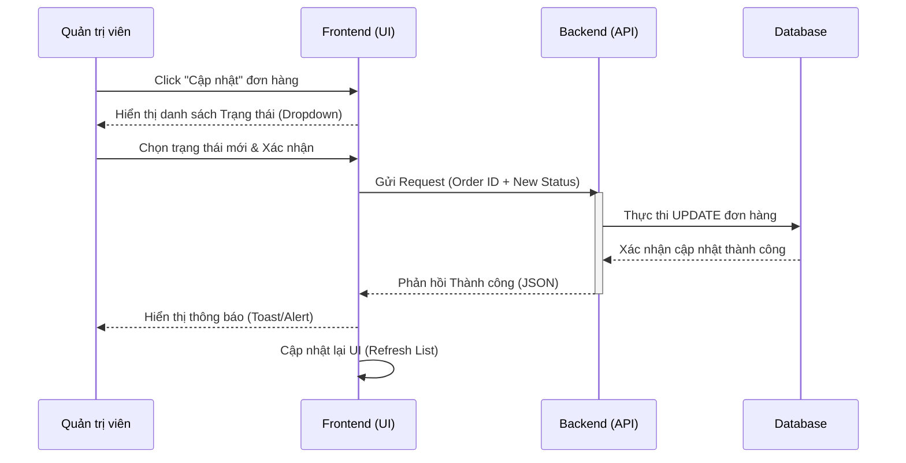
```mermaid
sequenceDiagram
    participant Admin as Quản trị viên
    participant FE as Frontend (UI)
    participant BE as Backend (API)
    participant DB as Database

    Admin->>FE: Click "Cập nhật" đơn hàng
    FE-->>Admin: Hiển thị danh sách Trạng thái (Dropdown)
    Admin->>FE: Chọn trạng thái mới & Xác nhận
  
    FE->>BE: Gửi Request (Order ID + New Status)
    activate BE
    BE->>DB: Thực thi UPDATE đơn hàng
    DB-->>BE: Xác nhận cập nhật thành công
  
    BE-->>FE: Phản hồi Thành công (JSON)
    deactivate BE
  
    FE-->>Admin: Hiển thị thông báo (Toast/Alert)
    FE->>FE: Cập nhật lại UI (Refresh List)
  
```

  **Sơ đồ luồng trạng thái đơn hàng:**

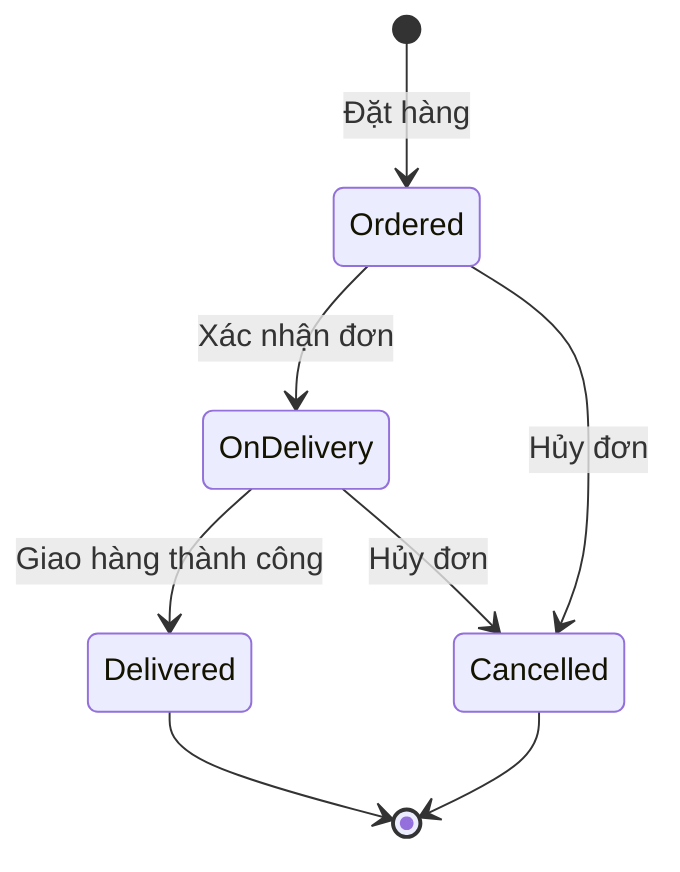
```mermaid
  stateDiagram-v2
      [*] --> Ordered: Đặt hàng
      Ordered --> OnDelivery: Xác nhận đơn
      Ordered --> Cancelled: Hủy đơn
      OnDelivery --> Delivered: Giao hàng thành công
      OnDelivery --> Cancelled: Hủy đơn
      Delivered --> [*]
      Cancelled --> [*]
```

---

### 6. Quản lý chat với người dùng

#### 6.1 Xem danh sách chat

  **Mô tả:** Hiển thị danh sách các cuộc trò chuyện với người dùng.

  **Chức năng:**

- Hiển thị danh sách người dùng đã chat:
  - Tên người dùng
  - Tin nhắn cuối cùng (rút gọn nếu quá dài)
  - Thời gian tin nhắn cuối
  - Badge số tin nhắn chưa đọc (nếu có)
- Sắp xếp: Người dùng có tin nhắn mới nhất ở trên
- Highlight người dùng đang chat
- Click vào người dùng để xem cuộc trò chuyện

#### 6.2 Chat với người dùng

  **Mô tả:** Admin trả lời tin nhắn từ người dùng.

  **Chức năng:**

- Giao diện chat:

  - Hiển thị tất cả tin nhắn trong cuộc trò chuyện
  - Phân biệt tin nhắn của admin và user (màu sắc khác nhau)
  - Hiển thị tên người gửi và thời gian
  - Tự động scroll xuống tin nhắn mới nhất
- Gửi tin nhắn:

  - Form nhập tin nhắn
  - Gửi tin nhắn qua AJAX
  - Hiển thị tin nhắn ngay sau khi gửi
  - Lưu vào database với `sender_type = 'admin'`
- Nhận tin nhắn:

  - Polling mỗi 2 giây để lấy tin nhắn mới
  - Tự động hiển thị tin nhắn mới từ user
  - Đánh dấu tin nhắn đã đọc khi admin xem
- Cập nhật badge số tin nhắn chưa đọc sau khi đọc

  **Luồng xử lý:**

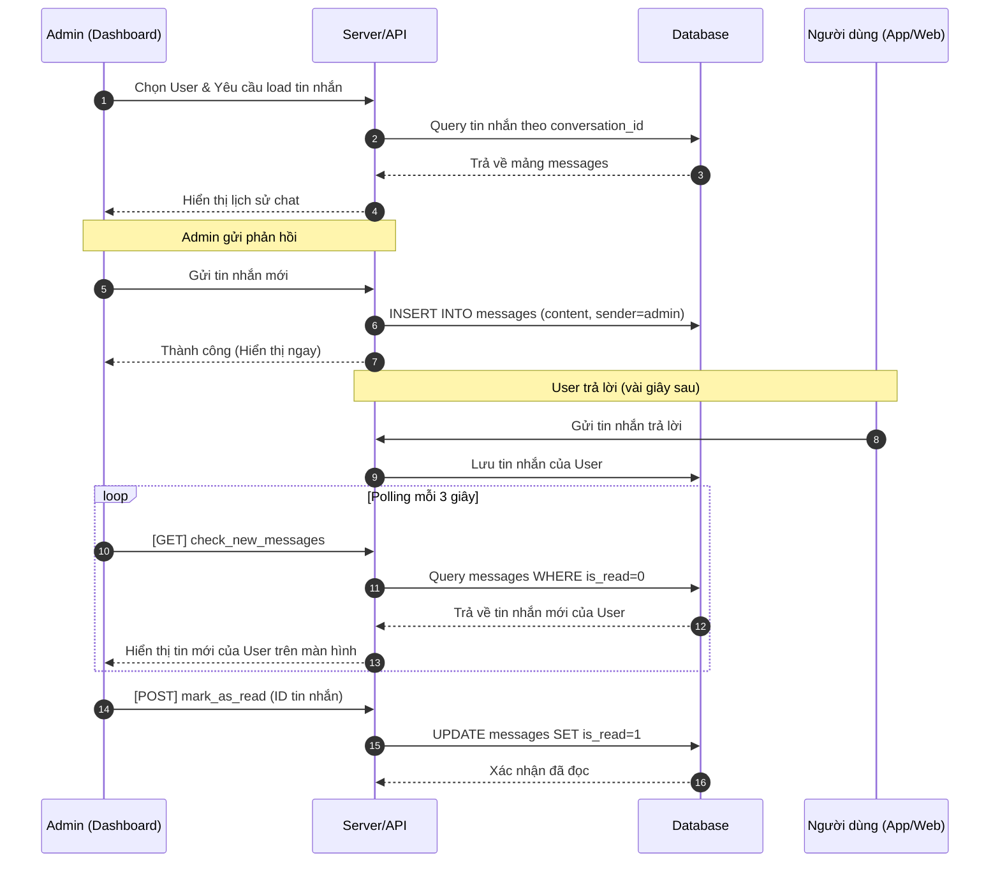
```mermaid
sequenceDiagram
    autonumber
    participant A as Admin (Dashboard)
    participant S as Server/API
    participant DB as Database
    participant U as Người dùng (App/Web)

    A->>S: Chọn User & Yêu cầu load tin nhắn
    S->>DB: Query tin nhắn theo conversation_id
    DB-->>S: Trả về mảng messages
    S-->>A: Hiển thị lịch sử chat
  
    Note over A, S: Admin gửi phản hồi
    A->>S: Gửi tin nhắn mới
    S->>DB: INSERT INTO messages (content, sender=admin)
    S-->>A: Thành công (Hiển thị ngay)
  
    Note over U, S: User trả lời (vài giây sau)
    U->>S: Gửi tin nhắn trả lời
    S->>DB: Lưu tin nhắn của User
  
    loop Polling mỗi 3 giây
        A->>S: [GET] check_new_messages
        S->>DB: Query messages WHERE is_read=0
        DB-->>S: Trả về tin nhắn mới của User
        S-->>A: Hiển thị tin mới của User trên màn hình
    end
  
    A->>S: [POST] mark_as_read (ID tin nhắn)
    S->>DB: UPDATE messages SET is_read=1
    DB-->>S: Xác nhận đã đọc
  
```

### 7. Quản Lý Hoàn Tiền

**Mục đích:** Cho phép quản trị viên tạo, xem và quản lý các yêu cầu hoàn tiền.

**Các chức năng chính:**

1. **Tạo yêu cầu hoàn tiền**

   - Nhập mã đơn hàng (`order_code`)
   - Nhập số tiền hoàn (`refund_amount`)
   - Nhập lý do hoàn tiền (`refund_reason`)
   - Chọn phương thức hoàn tiền (`refund_method`):
     - `original`: Hoàn về phương thức gốc
     - `bank_transfer`: Chuyển khoản ngân hàng
     - `cash`: Tiền mặt
2. **Validation và Kiểm tra**

   - Kiểm tra đơn hàng tồn tại
   - Kiểm tra đơn hàng đã thanh toán chưa
   - Kiểm tra đã có refund request chưa (tránh trùng lặp)
   - Tự động liên kết với payment record
3. **Danh sách yêu cầu hoàn tiền**

   - Hiển thị tất cả refund records
   - Thông tin chi tiết: ID, mã đơn, khách hàng, số tiền, lý do, trạng thái, phương thức, thời gian, người xử lý
   - Color coding theo trạng thái
4. **Cập nhật trạng thái hoàn tiền**

   - Modal popup để cập nhật
   - Chọn trạng thái mới:
     - `pending` → `processing` → `completed`
     - `pending` → `processing` → `failed`
   - Nhập mã giao dịch hoàn tiền (khi completed)
5. **Tự động cập nhật liên quan**

   - Cập nhật `payment.payment_status` = 'refunded'
   - Cập nhật `order.payment_status` = 'refunded'
   - Cập nhật `order.status` = 'Cancelled'
   - Ghi nhận `processed_by` (admin_id) và `processed_at`

**Luồng xử lý hoàn tiền:**

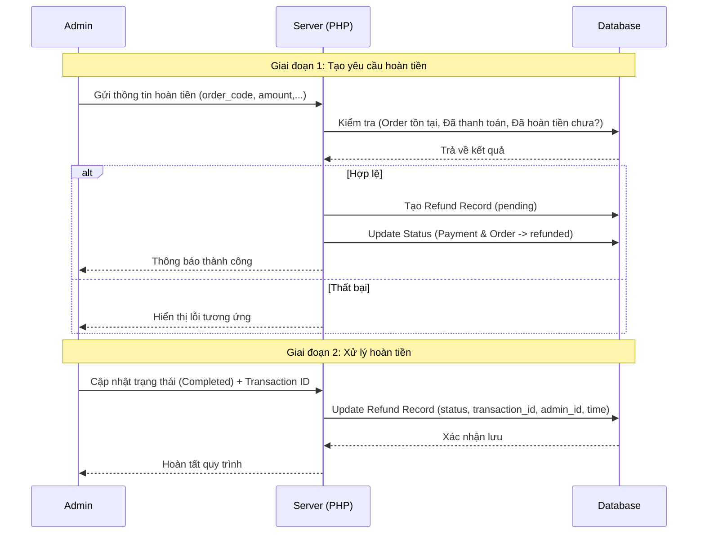
```mermaid
sequenceDiagram
    participant A as Admin
    participant S as Server (PHP)
    participant DB as Database

    Note over A, DB: Giai đoạn 1: Tạo yêu cầu hoàn tiền
    A->>S: Gửi thông tin hoàn tiền (order_code, amount,...)
    S->>DB: Kiểm tra (Order tồn tại, Đã thanh toán, Đã hoàn tiền chưa?)
    DB-->>S: Trả về kết quả
  
    alt Hợp lệ
        S->>DB: Tạo Refund Record (pending)
        S->>DB: Update Status (Payment & Order -> refunded)
        S-->>A: Thông báo thành công
    else Thất bại
        S-->>A: Hiển thị lỗi tương ứng
    end

    Note over A, DB: Giai đoạn 2: Xử lý hoàn tiền
    A->>S: Cập nhật trạng thái (Completed) + Transaction ID
    S->>DB: Update Refund Record (status, transaction_id, admin_id, time)
    DB-->>S: Xác nhận lưu
    S-->>A: Hoàn tất quy trình
```

5. **Status Workflow**

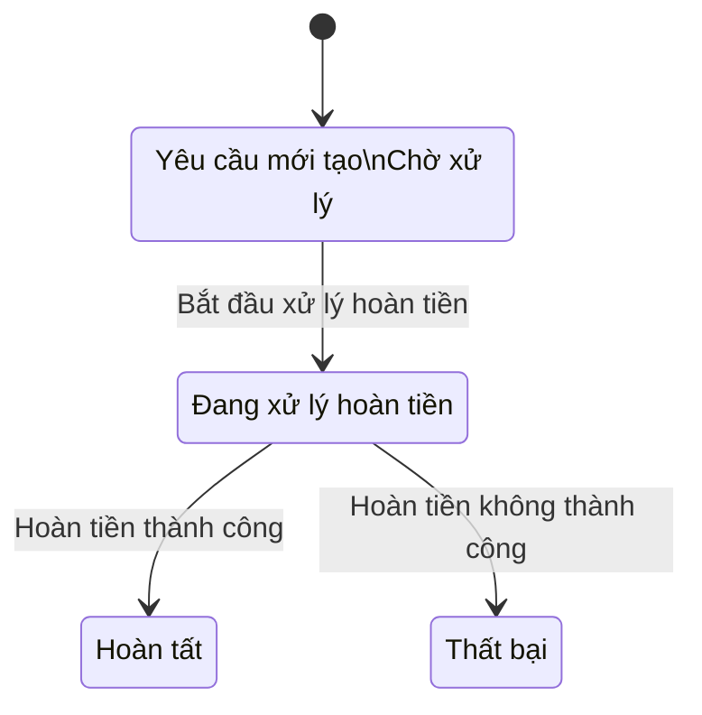
```mermaid
stateDiagram-v2
    [*] --> Pending

    Pending: Yêu cầu mới tạo\nChờ xử lý

    Pending --> Processing: Bắt đầu xử lý hoàn tiền

    Processing: Đang xử lý hoàn tiền

    Processing --> Completed: Hoàn tiền thành công
    Processing --> Failed: Hoàn tiền không thành công

    Completed: Hoàn tất
    Failed: Thất bại

```

**Mô tả trạng thái:**

- **pending**: Yêu cầu mới tạo, đang chờ admin xử lý
- **processing**: Admin đã bắt đầu xử lý, đang chờ hoàn tất
- **completed**: Đã hoàn tất, tiền đã được trả lại khách hàng
- **failed**: Xử lý thất bại, cần xử lý lại hoặc liên hệ khách hàng

**Tính năng đặc biệt:**

- Chỉ admin mới có quyền tạo và cập nhật refund
- Tracking đầy đủ ai xử lý và khi nào (`processed_by`, `processed_at`)
- Tự động cập nhật các bảng liên quan
- Hỗ trợ partial refund (số tiền hoàn < số tiền đã thanh toán)

---

### 8. Trang Quản Lý Thanh Toán

**Mục đích:** Cho phép quản trị viên xem và quản lý tất cả các giao dịch thanh toán trong hệ thống.

**Các chức năng chính:**

1. **Danh sách giao dịch thanh toán**

   - Hiển thị tất cả payment records
   - Sắp xếp theo thời gian (mới nhất trước)
   - Hiển thị đầy đủ thông tin: ID, mã đơn, phương thức, số tiền, trạng thái, mã giao dịch, thời gian
2. **Lọc và tìm kiếm**

   - Tìm kiếm theo order_code
   - Lọc theo trạng thái thanh toán
   - Lọc theo phương thức thanh toán
3. **Chi tiết giao dịch**

   - Click vào đơn hàng để xem chi tiết
   - Link đến trang quản lý đơn hàng
4. **Xử lý hoàn tiền**

   - Link nhanh đến trang hoàn tiền cho payment đã thành công
   - Tự động điền order_code

**Các trạng thái thanh toán:**

- **pending** (Chờ thanh toán) - màu cam
- **success** (Thành công) - màu xanh
- **failed** (Thất bại) - màu đỏ
- **cancelled** (Đã hủy) - màu xám
- **refunded** (Đã hoàn tiền) - màu tím

**Tính năng:**

- Real-time data từ database
- Color coding cho trạng thái
- Quick actions (Xem đơn hàng, Hoàn tiền)
- Responsive table design

---

## 5.3 Sơ đồ tổng quan hệ thống

### 5.3.1 Sơ đồ luồng người dùng

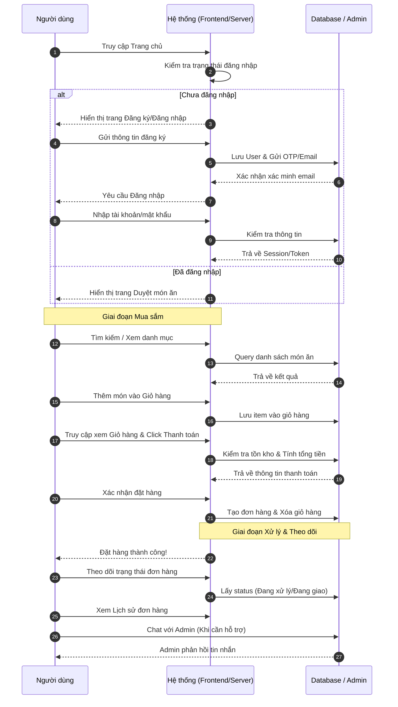
```mermaid
  sequenceDiagram
    autonumber
    participant U as Người dùng
    participant S as Hệ thống (Frontend/Server)
    participant DB as Database / Admin

    U->>S: Truy cập Trang chủ
    S->>S: Kiểm tra trạng thái đăng nhập

    alt Chưa đăng nhập
        S-->>U: Hiển thị trang Đăng ký/Đăng nhập
        U->>S: Gửi thông tin đăng ký
        S->>DB: Lưu User & Gửi OTP/Email
        DB-->>S: Xác nhận xác minh email
        S-->>U: Yêu cầu Đăng nhập
        U->>S: Nhập tài khoản/mật khẩu
        S->>DB: Kiểm tra thông tin
        DB-->>S: Trả về Session/Token
    else Đã đăng nhập
        S-->>U: Hiển thị trang Duyệt món ăn
    end

    Note over U, S: Giai đoạn Mua sắm
    U->>S: Tìm kiếm / Xem danh mục
    S->>DB: Query danh sách món ăn
    DB-->>S: Trả về kết quả
    U->>S: Thêm món vào Giỏ hàng
    S->>DB: Lưu item vào giỏ hàng
  
    U->>S: Truy cập xem Giỏ hàng & Click Thanh toán
    S->>DB: Kiểm tra tồn kho & Tính tổng tiền
    DB-->>S: Trả về thông tin thanh toán
    U->>S: Xác nhận đặt hàng
    S->>DB: Tạo đơn hàng & Xóa giỏ hàng
  
    Note over S, DB: Giai đoạn Xử lý & Theo dõi
    S-->>U: Đặt hàng thành công!
    U->>S: Theo dõi trạng thái đơn hàng
    S->>DB: Lấy status (Đang xử lý/Đang giao)
    U->>S: Xem Lịch sử đơn hàng
    U->>DB: Chat với Admin (Khi cần hỗ trợ)
    DB-->>U: Admin phản hồi tin nhắn
```

### 5.3.2 Sơ đồ luồng quản trị viên

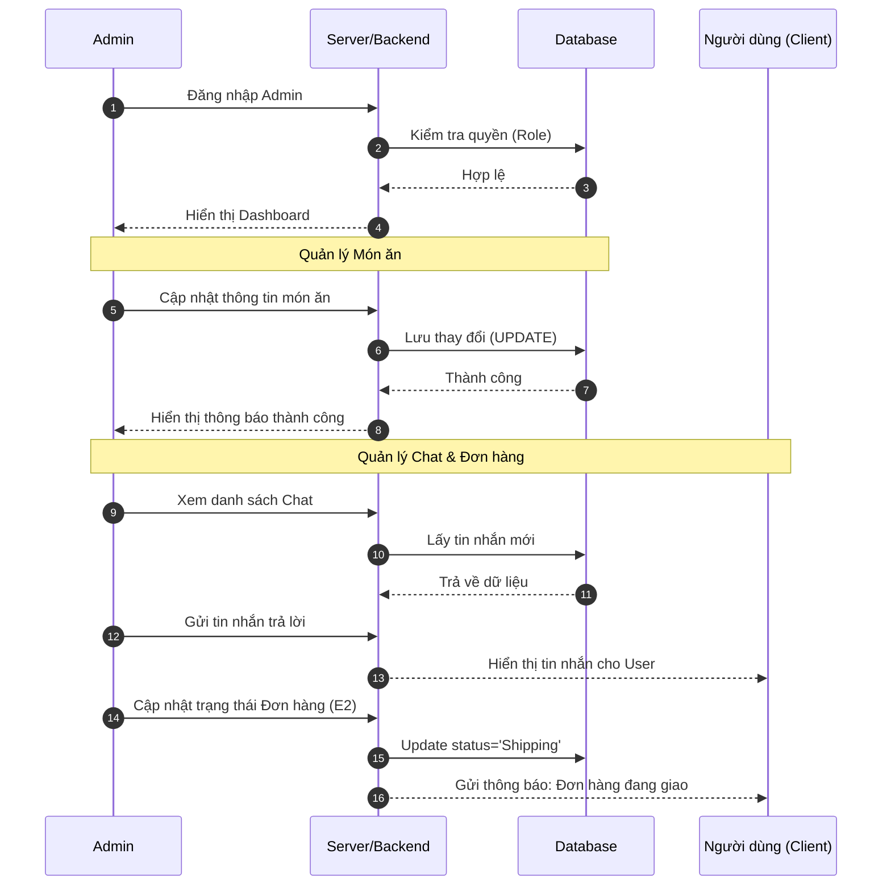
```mermaid
  sequenceDiagram
    autonumber
    participant A as Admin
    participant S as Server/Backend
    participant DB as Database
    participant U as Người dùng (Client)

    A->>S: Đăng nhập Admin
    S->>DB: Kiểm tra quyền (Role)
    DB-->>S: Hợp lệ
    S-->>A: Hiển thị Dashboard
  
    Note over A, DB: Quản lý Món ăn
    A->>S: Cập nhật thông tin món ăn
    S->>DB: Lưu thay đổi (UPDATE)
    DB-->>S: Thành công
    S-->>A: Hiển thị thông báo thành công

    Note over A, U: Quản lý Chat & Đơn hàng
    A->>S: Xem danh sách Chat
    S->>DB: Lấy tin nhắn mới
    DB-->>S: Trả về dữ liệu
    A->>S: Gửi tin nhắn trả lời
    S-->>U: Hiển thị tin nhắn cho User
  
    A->>S: Cập nhật trạng thái Đơn hàng (E2)
    S->>DB: Update status='Shipping'
    S-->>U: Gửi thông báo: Đơn hàng đang giao
```

### 5.3.4 Sơ đồ tương tác User - Admin

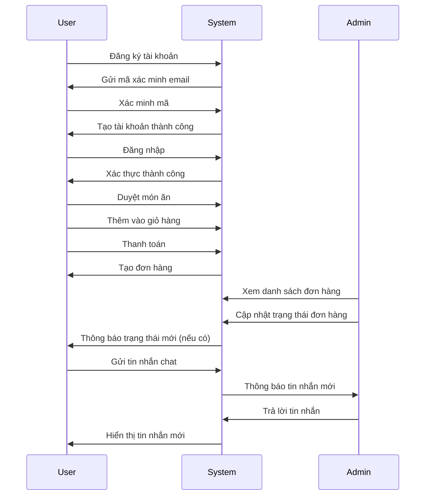
```mermaid
  sequenceDiagram
      participant U as User
      participant S as System
      participant A as Admin
  
      U->>S: Đăng ký tài khoản
      S->>U: Gửi mã xác minh email
      U->>S: Xác minh mã
      S->>U: Tạo tài khoản thành công
  
      U->>S: Đăng nhập
      S->>U: Xác thực thành công
  
      U->>S: Duyệt món ăn
      U->>S: Thêm vào giỏ hàng
      U->>S: Thanh toán
      S->>U: Tạo đơn hàng
  
      A->>S: Xem danh sách đơn hàng
      A->>S: Cập nhật trạng thái đơn hàng
      S->>U: Thông báo trạng thái mới (nếu có)
  
      U->>S: Gửi tin nhắn chat
      S->>A: Thông báo tin nhắn mới
      A->>S: Trả lời tin nhắn
      S->>U: Hiển thị tin nhắn mới
```

### 5.3.5 Sơ Đồ Luồng Thanh Toán

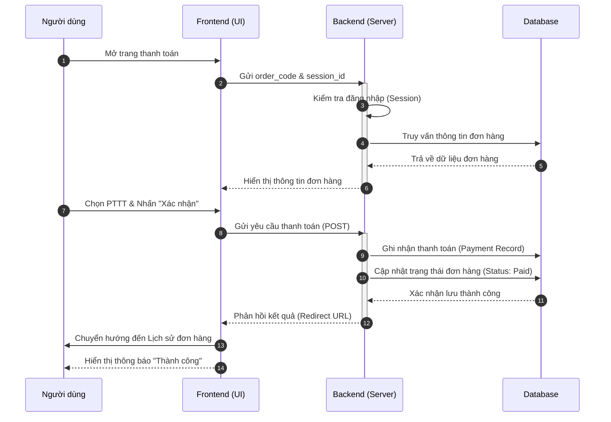
```mermaid
sequenceDiagram
    autonumber
    participant U as Người dùng
    participant FE as Frontend (UI)
    participant BE as Backend (Server)
    participant DB as Database

    U->>FE: Mở trang thanh toán
    FE->>BE: Gửi order_code & session_id
  
    activate BE
    BE->>BE: Kiểm tra đăng nhập (Session)
    BE->>DB: Truy vấn thông tin đơn hàng
    DB-->>BE: Trả về dữ liệu đơn hàng
    BE-->>FE: Hiển thị thông tin đơn hàng
    deactivate BE

    U->>FE: Chọn PTTT & Nhấn "Xác nhận"
    FE->>BE: Gửi yêu cầu thanh toán (POST)
  
    activate BE
    BE->>DB: Ghi nhận thanh toán (Payment Record)
    BE->>DB: Cập nhật trạng thái đơn hàng (Status: Paid)
    DB-->>BE: Xác nhận lưu thành công
    BE-->>FE: Phản hồi kết quả (Redirect URL)
    deactivate BE

    FE->>U: Chuyển hướng đến Lịch sử đơn hàng
    FE-->>U: Hiển thị thông báo "Thành công"


```

### 5.3.6 Sơ Đồ Luồng Hoàn Tiền

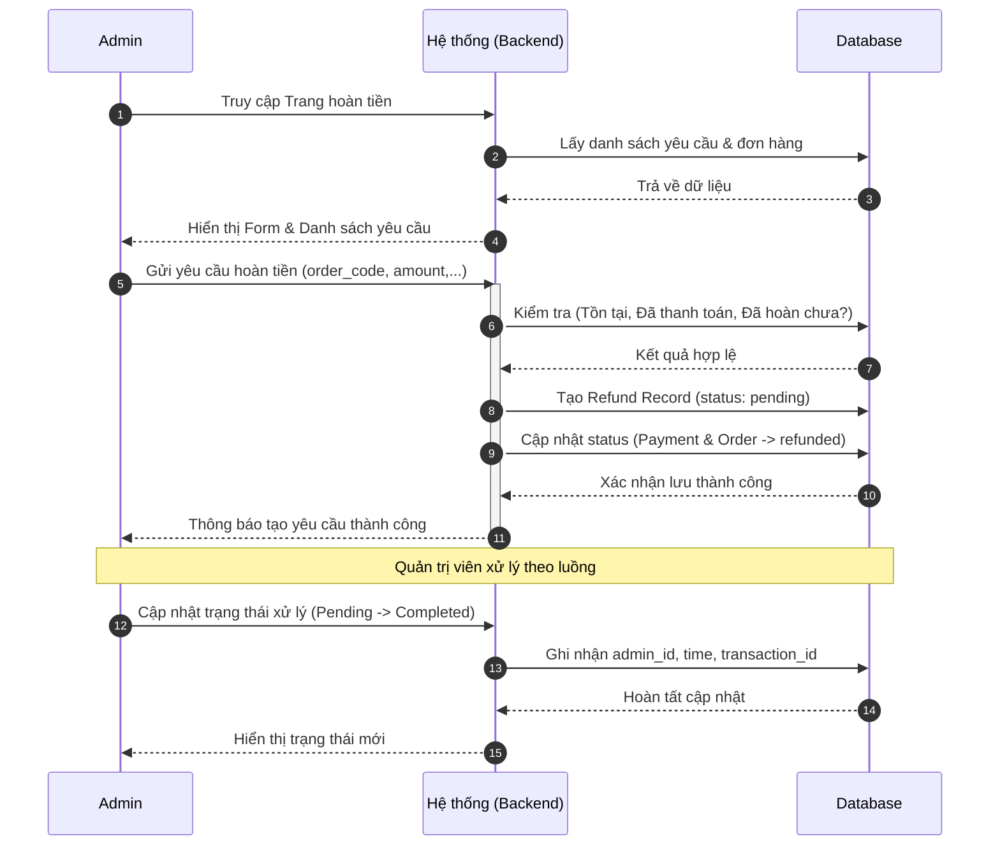
```mermaid
sequenceDiagram
    autonumber
    participant A as Admin
    participant S as Hệ thống (Backend)
    participant DB as Database

    A->>S: Truy cập Trang hoàn tiền
    S->>DB: Lấy danh sách yêu cầu & đơn hàng
    DB-->>S: Trả về dữ liệu
    S-->>A: Hiển thị Form & Danh sách yêu cầu

    A->>S: Gửi yêu cầu hoàn tiền (order_code, amount,...)
  
    activate S
    S->>DB: Kiểm tra (Tồn tại, Đã thanh toán, Đã hoàn chưa?)
    DB-->>S: Kết quả hợp lệ
  
    S->>DB: Tạo Refund Record (status: pending)
    S->>DB: Cập nhật status (Payment & Order -> refunded)
    DB-->>S: Xác nhận lưu thành công
    S-->>A: Thông báo tạo yêu cầu thành công
    deactivate S

    Note over A, DB: Quản trị viên xử lý theo luồng
    A->>S: Cập nhật trạng thái xử lý (Pending -> Completed)
    S->>DB: Ghi nhận admin_id, time, transaction_id
    DB-->>S: Hoàn tất cập nhật
    S-->>A: Hiển thị trạng thái mới
```

### 5.3.7 Sơ Đồ Trạng Thái Thanh Toán

```mermaid
sequenceDiagram
    autonumber
    participant U as Người dùng
    participant S as Hệ thống (System)
    participant G as Cổng thanh toán (Gateway)
    participant A as Quản trị viên (Admin)

    U->>S: Khởi tạo thanh toán
    S->>S: Tạo bản ghi (Trạng thái: Pending)
  
    alt Thanh toán thành công
        G-->>S: Gửi tín hiệu thành công (IPN/Webhook)
        S->>S: Cập nhật trạng thái: Success
        S-->>U: Thông báo: Thành công
    else Thanh toán thất bại
        G-->>S: Gửi tín hiệu lỗi
        S->>S: Cập nhật trạng thái: Failed
        S-->>U: Thông báo: Thất bại (Mời thử lại)
    else Hết thời gian (Timeout)
        S->>S: Cronjob quét đơn quá hạn
        S->>S: Cập nhật trạng thái: Cancelled
    end

    Note over A, S: Quy trình hậu mãi
    A->>S: Yêu cầu hoàn tiền (Refund request)
    S->>G: Gửi lệnh hoàn tiền qua API
    G-->>S: Xác nhận hoàn tiền thành công
    S->>S: Cập nhật trạng thái: Refunded
             
```

---

## 6. Thiết kế dữ liệu

Hệ thống Web Food được xây dựng nhằm phục vụ hoạt động đặt món ăn trực tuyến, quản lý đơn hàng và hỗ trợ khách hàng. Cơ sở dữ liệu **food-order** được thiết kế trên nền tảng MariaDB/MySQL, đáp ứng các yêu cầu lưu trữ, truy xuất và đảm bảo tính toàn vẹn dữ liệu.

Các nhóm dữ liệu chính trong hệ thống bao gồm:

* **Dữ liệu quản trị viên** : phục vụ cho việc quản lý hệ thống, theo dõi và xử lý các yêu cầu từ người dùng.
* **Dữ liệu người dùng** : lưu trữ thông tin tài khoản khách hàng đăng ký sử dụng dịch vụ.
* **Dữ liệu danh mục món ăn** : hỗ trợ phân loại món ăn theo từng nhóm cụ thể.
* **Dữ liệu món ăn** : quản lý thông tin chi tiết của các món được cung cấp trên hệ thống.
* **Dữ liệu đơn hàng** : ghi nhận quá trình đặt món, trạng thái và thông tin giao hàng.
* **Dữ liệu trò chuyện** : lưu lịch sử trao đổi giữa khách hàng và quản trị viên nhằm hỗ trợ và giải đáp thắc mắc.

Cách tổ chức dữ liệu theo mô hình quan hệ giúp hệ thống vận hành ổn định, dễ bảo trì và thuận tiện cho việc mở rộng trong tương lai.

### 6.1 Phân tích dữ liệu hệ thống
tbl_category (Danh mục)
├── id (PK)
├── title (Tên danh mục)
├── image_name
├── featured (Nổi bật)
└── active (Trạng thái)

tbl_food (Món ăn)
├── id (PK)
├── title (Tên món)
├── description (Mô tả)
├── price (Giá)
├── image_name
├── category_id (FK → tbl_category.id)
├── featured
└── active

tbl_cart (Giỏ hàng tạm thời)
├── id (PK)
├── user_id (FK → tbl_user.id)
├── food_id (FK → tbl_food.id)
├── food_name
├── price
└── quantity

tbl_order (Đơn hàng)
├── id (PK)
├── order_code (Mã đơn hàng duy nhất)
├── user_id (FK → tbl_user.id)
├── food (Tên món ăn)
├── price / qty / total
├── order_date
├── status (Ordered, On Delivery, Delivered, Cancelled)
└── customer_info (Name, Contact, Email, Address)

tbl_payment (Thanh toán)
├── id (PK)
├── order_code (FK → tbl_order.order_code)
├── user_id (FK → tbl_user.id)
├── payment_method (vnpay, momo, cash)
├── amount
├── transaction_id
└── payment_status

tbl_verification (Xác thực)
├── id (PK)
├── email / phone
├── verification_code (OTP)
├── verification_type (email/phone)
└── expires_at

tbl_chat (Hỗ trợ trực tuyến)
├── id (PK)
├── user_id (FK → tbl_user.id)
├── admin_id (FK → tbl_admin.id)
├── message
└── sender_type (user/admin)

tbl_user (Khách hàng)
├── id (PK)
├── full_name (Họ và tên)
├── username (Tên đăng nhập)
├── password (Mật khẩu mã hóa)
├── email
├── phone (Số điện thoại)
├── address (Địa chỉ giao hàng)
├── status (Trạng thái tài khoản: Active,...)
└── created_at

tbl_refund (Hoàn tiền)
├── id (PK)
├── order_code (FK → tbl_order.order_code)
├── payment_id (FK → tbl_payment.id)
├── user_id (FK → tbl_user.id)
├── refund_amount (Số tiền hoàn)
├── refund_reason (Lý do hoàn tiền)
├── refund_status (Trạng thái: pending, processing, completed, failed)
├── refund_method (Phương thức: original, bank_transfer, cash)
├── refund_transaction_id (Mã giao dịch hoàn tiền)
├── processed_by (Admin xử lý - FK → tbl_admin.id)
├── processed_at / created_at / updated_at

tbl_admin (Quản trị viên)
├── id (PK)
├── full_name
├── username
├── password
├── email
└── phone

### 6.2 Thiết kế dữ liệu (Lược đồ quan hệ)

Các bảng dữ liệu trong hệ thống được thiết kế như sau:
* **TBL_ADMIN** (id PK, full_name, email, username, password)
* **tbl_category** (id PK, title, image_name, featured, active)
* **tbl_food** (id PK, title, description, price, image_name, category_id FK, featured, active)
* **tbl_user / tbl_admin** (id PK, full_name, username, password, email, phone)
* **tbl_cart** (id PK, user_id FK, food_id FK, food_name, price, quantity)
* **tbl_order** (id PK, order_code, user_id FK, food, price, qty, total, order_date, status, customer_info)
* **tbl_payment** (id PK, order_code FK, user_id FK, payment_method, amount, transaction_id, payment_status)
* **tbl_verification** (id PK, email / phone, verification_code, verification_type, expires_at)
* **tbl_chat** (id PK, user_id FK, admin_id FK, message, sender_type)
* **tbl_user** (id PK, full_name, username, password, email, phone, address, status, created_at)
* **tbl_refund** (id PK, order_code FK, payment_id FK, user_id FK, refund_amount, refund_reason, refund_status, refund_method, refund_transaction_id, processed_by FK, processed_at / created_at / updated_at)
* **tbl_admin** (id PK, full_name, username, password, email, phone)

Các ràng buộc khóa ngoại được thiết lập nhằm đảm bảo tính toàn vẹn dữ liệu, đồng thời hỗ trợ kiểm soát mối quan hệ giữa các bảng.

### 6.3 Sơ đồ ERD
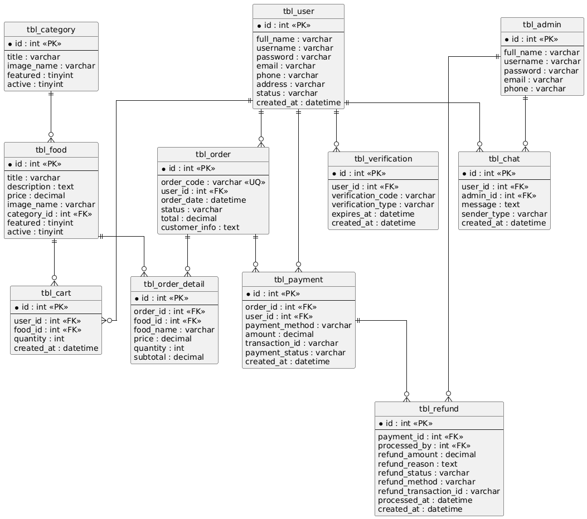
Sơ đồ ERD thể hiện rõ cấu trúc tổng thể của cơ sở dữ liệu và mối liên hệ giữa các bảng. Người dùng liên kết với bảng đơn hàng và bảng trò chuyện; quản trị viên tham gia vào quá trình trao đổi hỗ trợ; danh mục đóng vai trò phân loại cho các món ăn.

Mặc dù thiết kế hiện tại đáp ứng tốt nhu cầu của hệ thống, tuy nhiên bảng đơn hàng vẫn lưu trực tiếp tên món ăn thay vì liên kết khóa ngoại tới bảng món ăn. Điều này có thể gây khó khăn trong việc mở rộng và chuẩn hóa dữ liệu khi hệ thống phát triển lớn hơn.

**Kết luận:**
Thiết kế dữ liệu của hệ thống Web Food được xây dựng phù hợp với yêu cầu nghiệp vụ thực tế, đảm bảo khả năng quản lý, truy xuất và vận hành ổn định. Trong giai đoạn tiếp theo, hệ thống có thể được cải tiến bằng cách chuẩn hóa sâu hơn cấu trúc cơ sở dữ liệu nhằm nâng cao hiệu quả và tính mở rộng.
